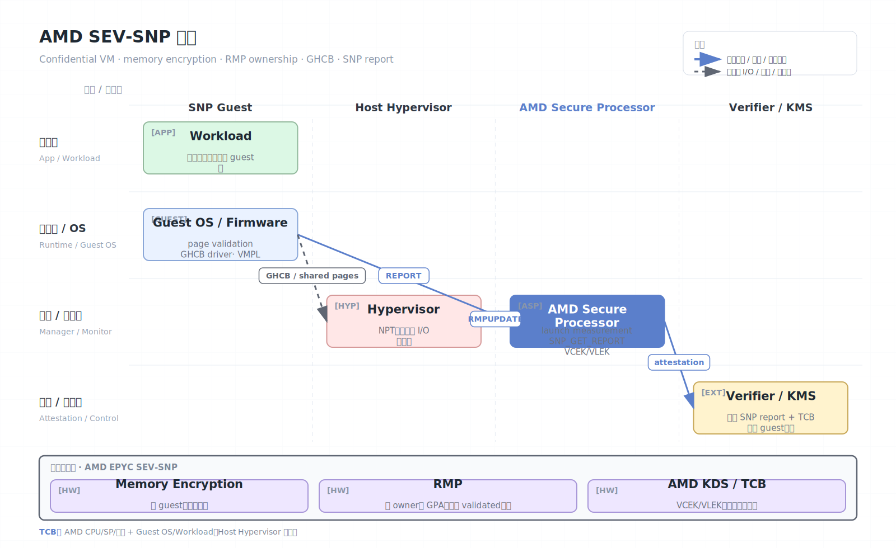

# AMD SEV-SNP

AMD Secure Encrypted Virtualization（SEV）是一组面向虚拟机的内存加密技术。SEV-SNP（Secure Nested Paging）是 SEV 系列的重要增强，在 SEV 的 VM 内存加密和 SEV-ES 的寄存器状态保护基础上，增加了对恶意 hypervisor 的内存重映射、重放和页状态攻击的硬件防护，并提供更强的 guest attestation。

## 架构图



## 技术演进

- SME：Secure Memory Encryption，提供系统内存加密能力。
- SEV：为不同 VM 使用不同内存加密密钥，使 hypervisor 难以读取 guest 内存明文。
- SEV-ES：加密 VM exit 时的 CPU register state，减少寄存器泄露和篡改。
- SEV-SNP：引入 RMP（Reverse Map Table）和页状态验证，增强内存完整性、所有权和 attestation。

## 核心机制

AMD SEV-SNP 的信任根是 CPU 与 AMD Secure Processor（也常称 PSP/ASP）。每个受保护 VM 拥有独立加密上下文，DRAM 中的 VM 内存以密文形式存在。Hypervisor 仍负责调度、二级页表、I/O 和设备模拟，但不能直接解密 guest 私有页。

SNP 的关键增强是 RMP。RMP 记录每个物理页当前归属、权限和状态，使硬件能够检查：

- 某个页是否被分配给指定 guest。
- Hypervisor 是否试图把同一页映射给多个 guest。
- Guest 是否已接受和验证某个页。
- 页状态转换是否符合 SNP 生命周期规则。

Guest 与 hypervisor 通常通过 GHCB（Guest-Hypervisor Communication Block）通信。GHCB 是显式共享的通信结构，guest 必须把其中内容视为不可信输入。

## 关键架构组件

SEV-SNP 的安全边界由几类组件共同构成：

| 组件 | 作用 |
| --- | --- |
| AMD Secure Processor | 管理 SEV 平台状态、证书、启动和 attestation report |
| ASID/加密上下文 | 区分不同 guest 的内存加密密钥 |
| RMP | Reverse Map Table，记录物理页 owner、权限和验证状态 |
| NPT | Nested Page Table，由 hypervisor 管理的二级页表 |
| GHCB | guest 与 hypervisor 的显式共享通信页 |
| VMPL | Virtual Machine Privilege Level，guest 内部进一步隔离特权层 |

SEV-SNP 的核心改进在于：早期 SEV 主要防 host 直接读内存明文，但难以阻止恶意 host 在二级页表里做别名、重映射、重放或页面替换；SNP 用 RMP 给每个物理页加上硬件检查的 owner 和状态，使“host 控制 NPT”不再等价于“host 可以任意重排 guest 私有内存”。

### RMP 与页状态

RMP 可以粗略看成物理页安全账本。每个页会记录：

- 当前是否分配给某个 guest。
- 页属于哪个 guest context。
- guest physical address 绑定关系。
- 页大小、权限、是否 validated。
- 是否允许 hypervisor 访问或仅 guest 私有访问。

Guest 接收新页时，需要执行 page state change / validation 流程。这样可防止 hypervisor 把未验证页面悄悄塞进 guest 私有地址空间。

```text
Hypervisor allocates page
  -> RMPUPDATE / page assignment
  -> guest validates page
  -> page usable as SNP private memory
  -> optional shared conversion for GHCB/I/O
```

### GHCB 通信模型

SEV-ES/SNP 会加密 VM exit 时的寄存器状态，因此 guest 不能像普通 VM 那样把所有 exit 信息裸露给 hypervisor。GHCB 提供一块双方约定的共享结构，让 guest 主动放入必要的请求信息，例如 CPUID、MSR 访问、I/O、AP 启动、异常处理等。

安全原则是：GHCB 是协议边界，不是信任边界。Guest 放入 GHCB 的内容会被 host 看到；host 返回的内容必须被 guest 校验。

## 启动、测量与密钥释放

SNP guest 的启动安全通常围绕 launch measurement 和 guest policy 展开：

1. 云平台或 hypervisor 创建 SNP guest。
2. 初始 guest memory、VMSA、固件和启动参数进入 launch digest。
3. AMD Secure Processor 根据启动流程形成 measurement。
4. Guest 启动后请求 attestation report，并在 report data 中放入 nonce 或临时公钥 hash。
5. Verifier 检查 measurement、policy、TCB、证书链、debug 状态和 report data。
6. KMS 把磁盘密钥、应用密钥或数据密钥加密给 guest 证明绑定的公钥。

生产策略里尤其要检查 debug bit、SMT/迁移策略、平台 TCB 和固件安全版本。SEV-SNP 的“是真平台”与“符合我的 workload 安全策略”不是同一件事。

## 远程证明

SEV-SNP 支持 guest 在运行时向 AMD Secure Processor 请求 attestation report。报告通常包含：

- Guest policy、measurement、launch digest 和安全版本。
- VMPL、平台 TCB、固件版本等属性。
- 调用方提供的 report data，用于绑定 nonce 或临时公钥。
- VCEK/VLEK 证书链和 AMD KDS collateral。

Verifier 不应只检查报告签名，还应检查 TCB 版本、guest policy、镜像度量、启动参数和密钥释放策略。云环境中常见做法是把 SNP attestation 与 KMS 或 secret manager 结合。

常见验证链路：

```text
SNP guest
  -> SNP_GET_REPORT(report_data = nonce || ephemeral_pubkey_hash)
  -> attestation report signed by VCEK/VLEK
  -> verifier fetches AMD KDS certificates / TCB collateral
  -> verifier checks measurement, policy, TCB, signature, freshness
  -> verifier releases secret to ephemeral key
```

VCEK 通常与具体芯片和 TCB 版本绑定；VLEK 则面向云平台/虚拟化环境的授权 key 模型。无论哪种方式，验证端都要把证书链和 TCB collateral 缓存/更新策略设计清楚。

## 安全模型

SEV-SNP 通常信任：

- AMD CPU、Secure Processor、微码和 SEV 固件。
- Guest firmware、guest kernel、驱动和用户态工作负载。
- Attestation verifier、证书链和密钥释放策略。

SEV-SNP 通常不信任：

- Host hypervisor、host OS、宿主机管理员。
- 同机其他 VM。
- 共享内存、虚拟设备、外部存储和网络。

## 安全边界与限制

- SNP 显著增强 VM 内存完整性，但不等于完整系统完整性。Guest OS 内漏洞仍可泄露秘密。
- 侧信道、计时、缓存和资源争用不是默认消失的风险。
- Hypervisor 仍可拒绝服务、影响调度、注入部分虚拟中断或操纵不可信 I/O。
- 设备直通、加速器和 DMA 需要 IOMMU、TDISP/Trusted I/O 或平台专门支持。
- 旧 SEV/SEV-ES 与 SEV-SNP 安全属性不同，不能混用威胁模型。
- 固件和平台补丁非常关键。证明策略应拒绝过旧 TCB。
- RMP 保护的是页归属和访问语义，不会自动验证 guest 应用逻辑。
- GHCB、共享页、virtio ring 和磁盘/network buffer 都是 host 可控输入。
- Host 可影响 CPUID 暴露、拓扑、时钟、中断节奏和资源调度；guest 需要做防御性假设。
- Crash dump、hibernation、snapshot、migration 会改变密钥和内存状态假设，必须使用 SNP-aware 机制。

## 与 TDX/CCA/SGX 的对比

| 项目 | SEV-SNP | 对照 |
| --- | --- | --- |
| 保护粒度 | 整 VM | 类似 TDX/CCA，区别于 SGX 应用 enclave |
| 核心机制 | 内存加密 + RMP 页归属 | TDX 是 PAMT/SEPT，CCA 是 GPT/granule |
| Guest-host 通信 | GHCB + shared pages | TDX/CCA 也使用共享页，但接口不同 |
| 证明 | SNP report + VCEK/VLEK | 需要 AMD KDS collateral |
| 开发改造 | 通常较低 | 适合 lift-and-shift confidential VM |
| 主要难点 | I/O、guest TCB、TCB collateral、侧信道 | VM 级 TEE 共同难点 |

## 工程落地

SEV-SNP 的优势是 VM 级透明度高，适合数据库、通用服务、机密 Kubernetes 节点和 AI 推理等已有工作负载。落地时需要关注：

- 云实例是否真的启用 SEV-SNP，而不是仅启用 SEV。
- Guest 镜像是否支持 SNP guest 驱动、attestation 和密钥注入。
- 是否把磁盘加密密钥、应用密钥与 attestation report 绑定。
- 是否避免在共享页、日志、崩溃转储和遥测中暴露敏感数据。

## 参考资料

- AMD SEV developer page: https://www.amd.com/en/developer/sev.html
- AMD SEV-SNP firmware ABI specification: https://www.amd.com/en/developer/sev.html
- Google Confidential VM overview: https://docs.cloud.google.com/confidential-computing/confidential-vm/docs/confidential-vm-overview
- Azure confidential VM overview: https://learn.microsoft.com/en-us/azure/confidential-computing/confidential-vm-overview
