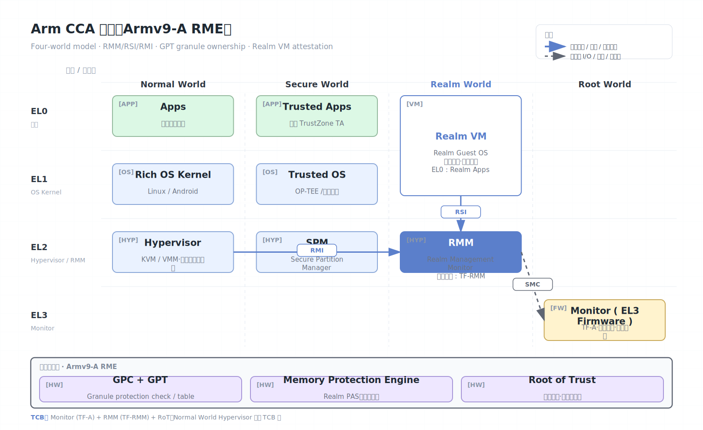

# Arm CCA

Arm Confidential Compute Architecture（CCA）是 Armv9-A 面向机密计算的体系结构。它在传统 Normal world 和 Secure world 之外引入 Realm world，使云和边缘平台能够运行受保护的 Realm VM。用户提到的 “ARM ACC” 通常应指 Arm CCA。

## 架构图



## 核心概念

- Realm：受 CCA 保护的执行环境，可承载机密 VM。
- RME（Realm Management Extension）：Arm CCA 的体系结构扩展，提供 Realm 内存隔离和状态转换。
- RMM（Realm Management Monitor）：管理 Realm 生命周期、Realm Execution Context 和证明的可信固件组件。
- GPT（Granule Protection Table）：按 granule 记录物理内存属于 Non-secure、Secure、Realm 或 Root 等安全状态。
- REC（Realm Execution Context）：Realm 中 vCPU/执行上下文的抽象。
- CCA attestation token：用于远程验证 Realm 度量和平台状态的证明。

## 工作原理

Arm CCA 把机密 VM 的安全边界从普通 hypervisor 中移出。Normal world 中的 host OS 和 hypervisor 仍负责资源管理、调度和普通 I/O，但 Realm 私有内存由 RME/GPT 和 RMM 保护。Host 不能直接访问 Realm 私有页，也不能把同一物理 granule 任意重映射到不可信地址空间。

RME 把传统 TrustZone 的 Normal/Secure 两世界扩展成四类安全状态：

| World | 典型内容 | 安全角色 |
| --- | --- | --- |
| Normal | Host OS、KVM/hypervisor、普通 VM、普通应用 | 不可信资源管理器 |
| Secure | 传统 TrustZone TEE、TEE OS、安全服务 | 设备安全服务 |
| Realm | Realm VM、confidential guest OS、租户 workload | 租户机密执行环境 |
| Root | EL3 firmware、monitor、启动链和 granule 控制 | 最高平台控制层 |

这个四世界模型的关键不是“多一个 VM 类型”这么简单，而是把物理内存归属和执行状态做成硬件可检查属性。Hypervisor 可以请求创建 Realm、分配 vCPU、提供内存、处理退出和 I/O，但它的 RMI 操作必须经过 RMM 检查；Realm 内部通过 RSI 请求证明、内存共享等服务。也就是说，hypervisor 仍是调度者，但不再是 Realm 私有状态的所有者。

```text
Normal World Hypervisor --RMI--> RMM --controls--> Realm descriptor / REC / granules
Realm Guest             --RSI--> RMM --serves---> attestation / memory share / feature query
Root EL3 firmware       -------> RME/GPT setup, world switching, RoT services
```

### RME、GPT 与 granule ownership

CCA 的核心内存机制是 Granule Protection Table（GPT）。Stage-2 页表仍负责虚拟化地址转换，但 GPT 负责回答另一个更底层的问题：这个物理 granule 当前属于哪个安全状态。即使 hypervisor 构造出一个能映射 Realm 物理页的 stage-2 页表，硬件在访问路径上仍会因 GPT 状态不匹配而阻止 Normal world 访问。

一个简化的 Realm 内存生命周期如下：

```text
Normal granule
  -> delegate to RMM
  -> assigned to Realm descriptor / data / REC
  -> measured or accepted by Realm
  -> used as private Realm memory
  -> optionally shared with Normal world
  -> reclaimed/destroyed after Realm teardown
```

这里有两个容易混淆的点：

- **地址转换不是安全归属**：hypervisor 管 stage-2，RMM/GPT 管 granule ownership。
- **共享页是显式降级**：Realm 为 I/O 暴露的页必须按不可信输入处理，不能把密钥、明文模型或中间状态放进去。

### RMM 的职责

RMM（Realm Management Monitor）是 CCA 的核心可信软件组件。它通常运行在 Realm EL2，受 Root/EL3 固件启动和度量。它负责：

- 创建和销毁 Realm descriptor。
- 管理 Realm Execution Context（REC），也就是 Realm vCPU 状态。
- 接受 hypervisor 的 RMI 请求，并拒绝破坏 Realm 隔离的操作。
- 管理 granule 状态转换、映射和撤销。
- 维护 Realm 初始度量，支持 attestation token 生成。
- 在 Realm exit/entry 时保存和恢复受保护状态。

RMM 的设计目标是让不可信 hypervisor 继续做资源管理，同时把会影响机密性和完整性的状态转换放到可信层检查。

典型启动流程：

1. 平台从 Root/EL3 固件建立信任链。
2. RMM 被加载和度量。
3. Host 请求创建 Realm，并把内存 granule 委派给 Realm。
4. RMM 验证状态转换，建立 Realm 初始度量。
5. Realm 运行 guest firmware、kernel 和 workload。
6. 远程 verifier 根据 CCA token 决定是否释放密钥。

CCA 和 TrustZone 的区别很重要。TrustZone 主要面向设备级 Secure world，常用于手机和嵌入式安全服务；CCA 面向多租户 confidential VM，目标是把云租户从 host hypervisor 中隔离出来。

## Realm VM 生命周期

一个 Realm VM 可以按以下安全状态理解：

1. **创建 Realm**：hypervisor 通过 RMI 请求创建 Realm。RMM 建立 Realm descriptor、IPA 空间配置、初始测量上下文和 REC 元数据。
2. **委派内存**：普通 granule 被 delegate 给 RMM，再由 RMM 分配给 Realm。被委派之后，Normal world 不再拥有该 granule 的直接访问权。
3. **加载和测量初始镜像**：guest firmware、kernel、initrd、设备树或配置数据进入 measurement。该值类似 TDX 的 MRTD/RTMR、SEV-SNP 的 launch digest、SGX 的 MRENCLAVE。
4. **激活 Realm**：RMM 关闭构建窗口，Realm 状态变为 runnable。之后 hypervisor 只能调度，不能修改私有初始状态。
5. **运行和退出**：Realm 因 I/O、异常、共享内存访问、中断等事件退出。RMM 决定哪些状态可暴露给 hypervisor。
6. **共享内存与 I/O**：Realm 显式共享 virtio ring、网络包、磁盘 bounce buffer 等页面。共享页必须做长度检查、完整性校验和协议认证。
7. **销毁与回收**：Realm 退出后，RMM 清理元数据并把 granule 安全地返回 Normal world，避免残留数据泄露。

## Attestation 机制

CCA attestation 通常包含两层 token：

- **Platform token**：证明平台硬件、Root of Trust、EL3 固件、RMM 版本和 TCB 状态。
- **Realm token**：证明某个 Realm 的初始 measurement、配置、属性和 Realm 绑定公钥。

一个典型密钥释放流程：

```text
Realm workload
  -> RSI request attestation with nonce/public key hash
  -> RMM constructs Realm claims
  -> platform attestation service signs or binds platform token
  -> Realm returns token set to remote verifier
  -> verifier checks platform, RMM, measurement, nonce, public key, TCB
  -> KMS releases secret encrypted to Realm-bound key
```

Verifier 不应只检查“这是 CCA 平台”。更合理的策略包括：

- 指定 RMM/firmware 版本和安全补丁下限。
- 绑定 Realm 初始镜像 measurement。
- 检查 debug、migration、IPA size、hash algorithm 等配置属性。
- 把 nonce 或会话公钥 hash 放入 claims，防止重放和中间人替换密钥。
- 对不同云厂商/SoC 的证书链建立明确 trust store。

## 软件栈视图

```text
+-----------------------------------------------------+
| Realm VM: guest firmware / guest kernel / workload  |
|  - attestation agent                                |
|  - virtio front-end with shared buffers             |
+--------------------------- Realm EL1/EL0 -----------+
| RMM: Realm lifecycle, REC state, granule ownership  |
+--------------------------- Realm EL2 ---------------+
| TF-A / EL3 firmware / Root monitor                  |
|  - RME enablement, GPT setup, world switch          |
+--------------------------- Root EL3 ----------------+
| Normal world: host Linux, KVM, QEMU/VMM, drivers    |
+--------------------------- Normal EL2/EL1 ----------+
```

常见开源组件包括 TF-A、TF-RMM、Linux/KVM Realm 支持、EDK2 Realm firmware、guest Linux、attestation verifier。实际可用性取决于 SoC、固件、内核版本、VMM 和云服务支持矩阵。

## 与相邻技术对比

| 技术 | 相同点 | 关键差异 |
| --- | --- | --- |
| TrustZone | 都使用 Arm 安全状态 | TrustZone 面向设备安全服务，CCA 面向多租户 confidential VM |
| Intel TDX | 都保护 VM 免受 host/VMM 访问 | TDX 使用 SEAM/TDX Module/PAMT，CCA 使用 Root/Realm/RMM/GPT |
| AMD SEV-SNP | 都是 VM 级 TEE | SNP 路线是内存加密 + RMP，CCA 路线是安全状态 + granule ownership |
| Intel SGX | 都不信任 OS/hypervisor | SGX 是进程内 enclave，CCA 是整 VM/Realm |
| Apple PCC | 都强调云侧可验证隐私 | PCC 是 Apple 封闭服务架构，CCA 是通用 Arm 平台架构 |

## 安全模型

Arm CCA 通常信任：

- Arm CPU/SoC 的 RME 实现、EL3 固件和启动链。
- RMM、Realm guest firmware、guest OS 和 workload。
- Attestation service 与 verifier policy。

Arm CCA 通常不信任：

- Normal world host OS、KVM/hypervisor、云管理员。
- 同机普通 VM 或其他 Realm。
- 普通世界的设备模拟、共享内存和 I/O 路径。

## 安全边界与限制

- CCA 的核心边界是 Realm 私有内存和 Realm 执行上下文，不自动保护所有设备。
- I/O 仍是难点。设备直通需要 SMMU/IOMMU、设备证明和平台策略配合。
- Host 仍可影响调度、资源和可用性。
- 侧信道和共享微架构资源需要实现和软件共同缓解。
- 生态仍在成熟中。不同 SoC、固件、RMM 版本、Linux/KVM 支持状态会影响可用性。
- Realm 内 guest OS 是租户 TCB 的一部分。CCA 防 host，不防 guest 内 root 或内核漏洞。
- 共享内存必须视为攻击面。Virtio descriptor、网络包、磁盘块、host 返回码都可能是恶意输入。
- Attestation 只证明“启动了什么”和“平台是什么状态”，不证明应用业务逻辑没有漏洞。
- Live migration、debug、crash dump、snapshot 等运维能力需要专门协议，否则会与机密性冲突。

## 适用场景

CCA 适合 Arm 服务器、边缘云、运营商基础设施和需要 VM 级隔离的多租户平台。它与 TDX、SEV-SNP 处于同一类技术，但会受到具体 Arm SoC、固件和云服务支持进度影响。

## 参考资料

- Arm CCA overview: https://www.arm.com/architecture/security-features/arm-confidential-compute-architecture
- Arm CCA documentation: https://developer.arm.com/documentation/den0125/latest/
- Arm CCA open-source software: https://www.trustedfirmware.org/projects/tf-rmm/
