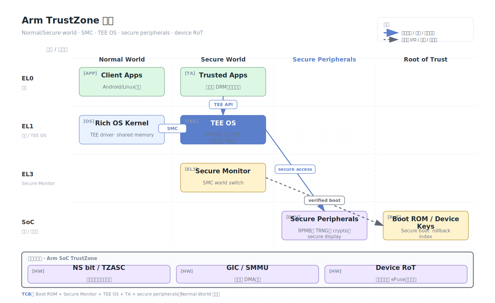

# Arm TrustZone

Arm TrustZone 是 Arm SoC 上广泛部署的安全隔离技术。它把系统划分为 Secure world 和 Non-secure world：普通操作系统通常运行在 Non-secure world，安全监控器、TEE OS 和可信应用运行在 Secure world。TrustZone 更像设备级安全基础设施，而不是云多租户机密 VM 技术。

## 架构图


## 核心概念

- Secure world：更高信任级别的执行世界，承载安全启动、密钥、TEE OS 和可信应用。
- Non-secure world：普通 rich OS，例如 Android、Linux 或 RTOS 应用环境。
- Secure Monitor：负责两个 world 之间切换的低层软件。
- NS bit：总线事务、页表、缓存和外设访问中的安全状态标记。
- TEE OS：如 OP-TEE，提供可信应用运行时、加密服务和安全存储。
- Trusted Application（TA）：运行在 TEE OS 内的安全应用。

## 工作原理

TrustZone 的隔离不是只发生在 CPU 指令层，而是贯穿 SoC。内存控制器、总线、防火墙、中断控制器和外设都可以根据安全状态决定访问权限。一个典型移动设备中，普通 Android kernel 无法直接读取 Secure world 的内存，也不能访问被标记为 secure 的密钥外设或安全显示路径。

常见调用路径：

1. Non-secure 应用调用 TEE client API。
2. Linux/Android 驱动发起 SMC（Secure Monitor Call）。
3. Secure Monitor 切换到 Secure world。
4. TEE OS 调度对应 TA。
5. TA 处理密钥、签名、生物识别或 DRM 逻辑。
6. 结果通过共享内存返回 Non-secure world。

TrustZone 的安全性高度依赖 SoC 集成。CPU 只提供基础状态和切换机制；真正的安全边界需要内存区域、外设、DMA、中断、调试口、启动链和固件共同正确配置。

## 硬件安全状态与 SoC 视角

TrustZone 的核心是给处理器、总线事务和外设访问附加安全状态。常见实现中，AXI 总线事务携带 NS（Non-secure）属性，内存控制器、TZASC/TZPC、GIC、中断路由和外设防火墙据此决定是否允许访问。

```text
Normal World app
  -> Linux/Android kernel
  -> SMC call
  -> Secure Monitor
  -> Secure World TEE OS
  -> Trusted Application / secure peripheral
```

典型隔离对象：

- Secure DRAM carveout：TEE OS 和 TA 的内存。
- Secure storage key：由硬件唯一密钥或 RPMB 派生保护。
- Secure peripheral：安全键盘、显示路径、加密引擎、eFuse、TRNG。
- Secure interrupt：只路由到 Secure world 的中断。
- Debug/authentication：JTAG、trace、crash dump 的安全锁定。

因此，TrustZone 不是“一个 enclave 指令集”，而是一整套 SoC 集成安全模型。

## 启动链与密钥层级

TrustZone 常与 secure boot 绑定：

1. Boot ROM 从不可变代码开始执行。
2. 验证 BL1/BL2/TF-A 或厂商安全固件签名。
3. 初始化 TrustZone address space controller、外设安全属性和调试锁。
4. 加载 Secure Monitor 和 TEE OS。
5. 验证并启动 Normal world bootloader/kernel。
6. TEE OS 根据签名策略加载 Trusted Application。

密钥通常按层级派生：

- Hardware Unique Key 或 device root key。
- Secure boot public key/hash。
- TEE storage key。
- TA-specific sealing key。
- 应用会话密钥或远程证明密钥。

不同 SoC 的 key ladder 差异很大，不能只凭“支持 TrustZone”判断密钥是否不可导出、是否防回滚、是否绑定设备状态。

## TEE OS 与 TA 模型

以 OP-TEE 风格模型为例：

| 层 | 作用 |
| --- | --- |
| Client Application | Normal world 用户态应用，发起 TEE Client API |
| TEE driver | Normal world kernel 驱动，管理共享内存和 SMC |
| Secure Monitor | 切换 world，保存/恢复上下文 |
| TEE OS | Secure world 内核，调度 TA、管理安全存储 |
| Trusted Application | 处理密钥、签名、生物识别、DRM 等敏感逻辑 |

共享内存是 Normal/Secure 通信的主要攻击面。TA 不应信任 Normal world 传入的命令 ID、长度、offset、handle 和对象生命周期。

## Attestation 与设备身份

TrustZone 没有像 CCA 那样统一的云 VM attestation profile。实际证明能力通常由厂商定义，例如 Android Key Attestation、设备证书链、TEE attestation applet 或远程密钥注入协议。Verifier 需要明确：

- 证明的是设备硬件、TEE OS、TA，还是 Android/bootloader 状态。
- 是否包含 rollback index、patch level、boot state、verified boot key。
- 证明密钥是否硬件保护，证书链根是谁。
- 是否能区分调试设备、解锁 bootloader、工程固件。

## 安全模型

TrustZone 通常信任：

- SoC 硬件、Boot ROM、secure boot chain。
- Secure Monitor、TEE OS、可信应用和安全外设配置。
- 设备厂商签名、密钥管理和回滚保护机制。

TrustZone 通常不信任：

- Normal world OS、普通应用、root 权限攻击者。
- 普通世界驱动、文件系统、网络和 UI 输入。

## 安全边界与限制

- TrustZone 不是天然多租户云隔离技术。Secure world 通常是平台共享高权限环境，多个 TA 的隔离取决于 TEE OS。
- Secure world 漏洞影响很大，因为它常持有设备根密钥、支付密钥或生物识别数据。
- 共享内存和 TEE client API 是主要攻击面，需要严格参数验证。
- 侧信道、物理攻击、电压/时钟 glitch、调试口和供应链攻击需要额外防护。
- 不同厂商实现差异大，安全属性不能只根据“支持 TrustZone”判断。
- Normal world 可控制调用频率、共享内存内容、系统负载和部分电源状态，TA 要防重入、TOCTOU 和资源耗尽。
- Secure world 是高价值目标。一个 TEE OS 漏洞可能跨应用影响支付、DRM、密钥库和生物识别。
- DMA 和外设安全配置错误会绕过 CPU world 隔离。
- 安全存储通常依赖 RPMB/rollback index；缺失防回滚会削弱密钥保护。

## 与 Arm CCA 的区别

| 维度 | TrustZone | Arm CCA |
| --- | --- | --- |
| 安全状态 | Normal/Secure 两世界 | Normal/Secure/Realm/Root 四世界 |
| 主要场景 | 手机、IoT、设备安全服务 | 云/边缘 confidential VM |
| 隔离单位 | TEE OS/TA，通常平台共享 | 多个动态 Realm VM |
| 资源管理 | 较静态，SoC/厂商配置主导 | 动态 granule delegation |
| 威胁模型 | Normal world 不可信 | Host/hypervisor/VMM 明确不可信 |
| 证明生态 | 厂商/平台差异大 | CCA token profile 更面向云证明 |

## 适用场景

TrustZone 适合设备 root of trust、可信启动、密钥存储、移动支付、DRM、生物识别、IoT 设备身份和安全固件服务。如果目标是云租户隔离，应优先看 Arm CCA；如果目标是在 RISC-V 上研究可定制 TEE，可看 Keystone。

## 参考资料

- Arm TrustZone for Cortex-A: https://www.arm.com/technologies/trustzone-for-cortex-a
- OP-TEE: https://optee.readthedocs.io/
- Trusted Firmware-A: https://www.trustedfirmware.org/projects/tf-a/
