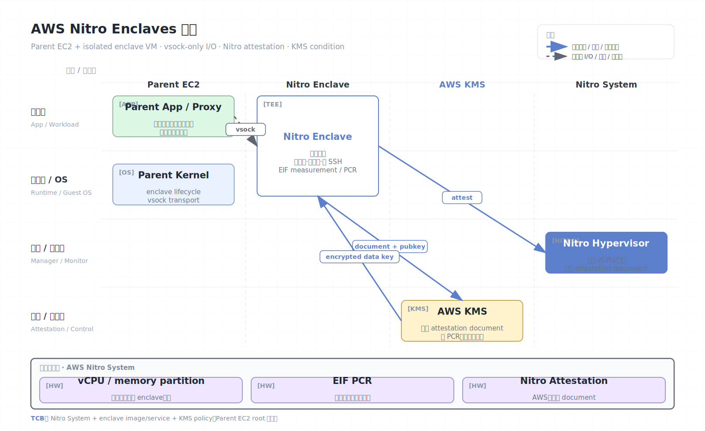

# AWS Nitro Enclaves

AWS Nitro Enclaves 是 Amazon EC2 的 enclave 功能。它从一台父 EC2 实例中切分 vCPU 和内存，创建一个隔离、受约束的 enclave VM。Enclave 没有持久化存储、没有交互式 shell、没有外部网络，只能通过 vsock 与父实例通信。

## 架构图


## 核心概念

- Parent instance：启动和管理 enclave 的普通 EC2 实例。
- Enclave：从父实例切分出的隔离 VM，用于处理敏感数据。
- Nitro Hypervisor：提供父实例与 enclave 的 CPU/内存隔离。
- vsock：父实例与 enclave 的本地通信通道。
- Enclave Image File（EIF）：enclave 镜像格式，其度量进入 attestation document。
- Attestation document：Nitro 为 enclave 身份、镜像度量和公钥生成的签名证明。
- KMS condition：AWS KMS 可根据 attestation 只向特定 enclave 释放密钥。

## 工作原理

Nitro Enclave 的设计强调“强约束”。父实例负责拉取数据、转发网络请求、写入日志或访问 KMS；enclave 只运行敏感计算。父实例 root 用户不能 SSH 到 enclave，也不能读取 enclave 内存，但父实例仍控制输入输出和生命周期。

典型密钥处理流程：

1. 开发者构建 enclave 镜像，生成 EIF measurement。
2. 父实例启动 enclave，分配 vCPU 和内存。
3. Enclave 内服务生成临时密钥或请求。
4. Enclave 获取 Nitro attestation document。
5. AWS KMS 验证 attestation 条件，向 enclave 公钥加密返回数据密钥。
6. Enclave 解密数据并完成敏感处理。

这种模式常用于把 TLS 私钥、数据库解密密钥、PII 处理逻辑、签名服务放入更窄的边界。

## 隔离模型与资源切分

Nitro Enclaves 从父 EC2 实例中划走固定数量的 vCPU 和内存。Enclave 不是普通 EC2 实例，也没有独立 ENI/EBS/IMDS。它的“缺功能”本身就是安全机制：

| 能力 | Enclave 状态 | 安全含义 |
| --- | --- | --- |
| 外部网络 | 无 | 降低数据直接外传路径 |
| 持久磁盘 | 无 | 减少请求后残留 |
| SSH/交互 shell | 无 | 降低运维绕过路径 |
| Instance metadata | 无 | 不能直接拿父实例凭据 |
| 通信 | vsock only | I/O 必须经过父实例代理 |

这种设计把攻击面收缩到三处：enclave 镜像本身、vsock 协议、父实例代理逻辑。父实例仍然是强不可信组件：它可以篡改请求、重放数据、丢弃响应、改变顺序或拒绝服务。

## EIF measurement 与 PCR

Enclave Image File（EIF）在构建时会形成多个 measurement/PCR 值。KMS policy 常根据这些值判断是否允许解密。实践中至少要区分：

- 镜像内容 measurement：代码、runtime、依赖和入口点。
- 签名证书/构建身份：谁构建和签署了 EIF。
- 启动配置：部分场景中需要绑定 enclave 启动参数。
- Enclave 内生成的公钥：通过 attestation document 的 user data/public key 绑定密钥释放通道。

密钥释放策略不要只写“来自 Nitro Enclave 即可”。更安全的是绑定预期 PCR、账户、region、KMS key policy、父实例 role 和业务上下文。

## Attestation document 与 KMS 流程

典型流程可以细化为：

```text
Enclave starts service
  -> generates ephemeral key pair
  -> asks Nitro Hypervisor for attestation document
  -> includes nonce/user data/public key hash
  -> parent forwards document to AWS KMS
  -> KMS verifies AWS Nitro signature and PCR policy
  -> KMS returns ciphertext encrypted for enclave key
  -> parent forwards ciphertext, enclave decrypts inside boundary
```

父实例只是搬运工。它可以看到 KMS 请求元数据，但不应看到数据密钥明文。Enclave 应验证父实例传入的业务数据签名、时间戳、nonce 和协议状态，避免父实例重放旧密文或旧请求。

## 典型软件栈

```text
Parent EC2 instance
  - application proxy / vsock proxy
  - KMS client or network forwarder
  - logging/metrics without secrets
  - enclave lifecycle manager

Nitro Enclave
  - minimal Linux/rootfs
  - sensitive service
  - attestation document request
  - local key unwrapping and cryptographic operation
```

常见工程模式：

- 把 TLS private key 放入 enclave，父实例只代理 TCP。
- 把 PII tokenization/de-tokenization 放入 enclave。
- Enclave 从 KMS 解密 envelope key，处理数据库字段级加密。
- 父实例只保留密文和不可逆标识。

## 安全模型

Nitro Enclaves 通常信任：

- AWS Nitro System、Nitro Hypervisor 和 attestation 根。
- Enclave 镜像、运行时和应用。
- KMS policy、IAM policy 和 attestation condition。

Nitro Enclaves 通常不信任：

- 父实例中的普通进程、root 用户和应用层攻击者。
- 外部网络、父实例代理、日志和存储。
- 同一父实例中 enclave 外的代码。

## 安全边界与限制

- Enclave 无直接网络和存储是安全优势，也是工程约束。所有 I/O 都要通过父实例代理。
- 父实例可拒绝服务、重放旧输入、篡改外部响应或隐瞒网络状态，因此协议必须认证、加密和防重放。
- Enclave 不能修复应用漏洞。若敏感服务本身可被远程利用，攻击者仍可能在 enclave 内执行代码。
- Attestation policy 是核心控制点。KMS 条件应绑定 PCR/measurement、镜像版本和业务上下文。
- Nitro Enclaves 是 AWS 专有平台能力，不是跨云可移植 TEE 标准。
- Enclave 内 runtime 和应用漏洞仍可导致密钥泄露或签名滥用。
- 父实例日志、代理 buffer、core dump 和 metrics 不能记录明文请求或密钥材料。
- Enclave 没有外网并不等于没有外传：父实例可被 enclave 服务响应内容当作 covert channel。
- 更新镜像后 PCR 会变化，KMS policy 和发布流程必须同步管理。

## 与 SGX/VM 级 TEE 的对比

| 维度 | Nitro Enclaves | SGX | TDX/SEV-SNP |
| --- | --- | --- | --- |
| 粒度 | 父实例内隔离 micro-VM | 进程 enclave | 整 VM |
| I/O | vsock 经过父实例 | OCALL/不可信 runtime | guest OS + shared pages |
| 部署 | AWS EC2 专有 | Intel CPU 生态 | 多云 confidential VM |
| 密钥集成 | AWS KMS attestation condition | DCAP/自建 KMS | 云 KMS/attestation |
| 优势 | 强约束、KMS 集成简单 | 小 TCB | 迁移现有 workload |

## 适用场景

Nitro Enclaves 适合密钥使用、签名、证书私钥保护、PII tokenization、隐私数据转换和小型高价值服务。若需要迁移整台 VM，应评估 AWS 上的 confidential VM 能力或其他云 TDX/SEV-SNP；若需要 GPU 机密计算，应看 NVIDIA CC 与云实例组合。

## 参考资料

- AWS Nitro Enclaves overview: https://docs.aws.amazon.com/enclaves/latest/user/nitro-enclave.html
- AWS Nitro System security design: https://docs.aws.amazon.com/whitepapers/latest/security-design-of-aws-nitro-system/the-aws-nitro-system.html
- Nitro Enclaves KMS integration: https://docs.aws.amazon.com/enclaves/latest/user/kms.html
