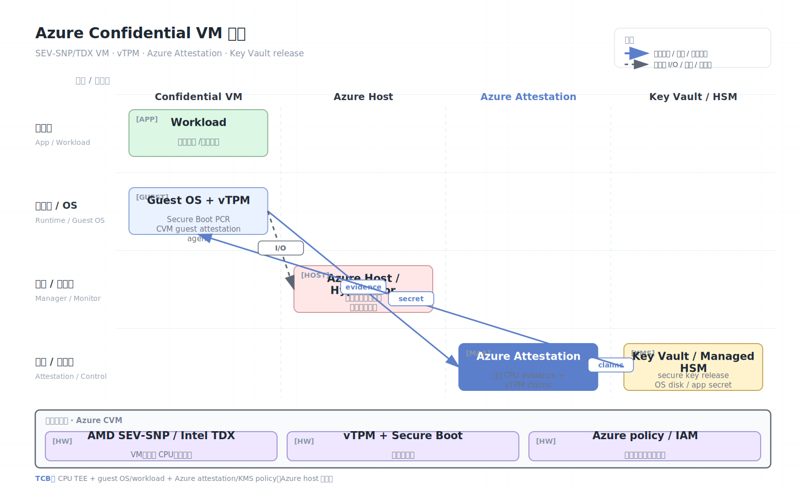

# Azure Confidential VM

Azure Confidential VM 是 Microsoft Azure 的机密虚拟机服务，底层使用 AMD SEV-SNP 或 Intel TDX 等硬件 TEE。它面向“尽量少改代码”的云迁移：把整台 VM 置于硬件隔离边界内，同时结合 vTPM、Secure Boot、attestation 和机密 OS 磁盘加密。

## 架构图


## 核心能力

- VM 级硬件隔离：在 VM、hypervisor 和 host 管理代码之间建立硬件边界。
- Guest attestation：VM 可验证自己运行在 SEV-SNP 或 TDX 平台上。
- vTPM：为 VM 提供 TPM 2.0 风格的测量、密钥和安全状态。
- Confidential OS disk encryption：OS 磁盘密钥绑定到 VM 的证明和 vTPM。
- Secure key release：密钥释放与平台 attestation 成功结果绑定。
- Secure Boot：验证启动组件签名，降低启动链篡改风险。

## 工作原理

Azure Confidential VM 的启动链通常把平台硬件证明、固件度量、vTPM 状态和磁盘密钥释放连接起来。若平台缺少关键隔离设置，例如未启用 SEV-SNP，attestation 不应通过，VM 也不应获得解密启动磁盘所需密钥。

从用户视角，Confidential VM 仍是 IaaS VM。应用通常不需要改写为 enclave 结构，但为了获得完整保护，需要额外配置：

- 选择支持 confidential VM 的实例族和区域。
- 使用合格 OS 镜像。
- 开启或明确选择 confidential OS disk encryption。
- 在应用密钥释放前执行 guest attestation。
- 避免把敏感数据写入未加密临时盘、日志或外部遥测。

## Azure 组合架构

Azure Confidential VM 是“硬件 TEE + Azure control plane + guest agent/attestation + key release”的组合，而不是单独的 CPU 功能。可以按如下路径理解：

```text
CPU TEE:        AMD SEV-SNP or Intel TDX
Guest VM:       UEFI/Secure Boot, vTPM, guest OS, workload
Azure services: Attestation, Key Vault/Managed HSM, disk encryption
Operations:     image gallery, policy, backup, monitoring, update flow
```

硬件 TEE 防 host 读 VM 内存；vTPM 和 Secure Boot 记录启动链；Azure Attestation 把这些证据变成服务可消费的声明；Key Vault/Managed HSM 根据声明释放密钥。安全性取决于整条链，而不只是实例 SKU。

## vTPM、Secure Boot 与磁盘密钥

Confidential VM 常见目标是让 OS disk 的解密也受证明控制。简化流程：

1. VM 在 SEV-SNP/TDX-capable host 上启动。
2. UEFI/Secure Boot 测量启动组件到 vTPM PCR。
3. Guest attestation 收集 CPU TEE evidence 和 vTPM state。
4. Azure Attestation 验证平台和启动状态。
5. Key release policy 允许解封 OS disk key 或应用 secret。
6. Guest 解密磁盘并继续启动 workload。

这比“普通 VM + 磁盘加密”更强，因为 host/control plane 不应能在未满足证明条件时拿到磁盘密钥。

## 应用密钥释放模式

除了 OS 磁盘，应用也可以自己做 attestation：

```text
workload starts inside CVM
  -> requests guest attestation evidence
  -> sends evidence to verifier / Azure Attestation
  -> verifier checks TEE type, image, vTPM PCRs, security version
  -> Key Vault releases application key
```

建议把策略绑定到：

- 目标 TEE 类型：SEV-SNP 或 TDX。
- VM image/UEFI/Secure Boot/vTPM PCR。
- Guest OS 版本和安全启动状态。
- 是否允许 debug、hibernation、扩展。
- 应用自身 measurement 或签名。

只依赖 Azure 资源 ID 或 VM 名称不足以表达机密计算边界。

## 运营与功能差异

Confidential VM 会影响运维能力：

- 某些备份、快照、迁移、扩展、诊断功能可能有额外限制。
- 传统内存 dump/debug 无法按普通 VM 方式工作。
- 自定义镜像需要确认是否支持 CVM、vTPM、Secure Boot 和 guest attestation。
- Kubernetes/AKS confidential node 还要考虑节点镜像、容器 runtime、secret 注入和 pod 边界。

安全团队需要把这些差异写入运行手册，否则容易为了排障关闭关键保护。

## 安全模型

Azure Confidential VM 通常信任：

- 底层 CPU TEE（AMD SEV-SNP 或 Intel TDX）。
- Azure attestation、vTPM 和密钥释放服务。
- Guest OS、驱动、应用和镜像供应链。

通常不信任：

- Host hypervisor 和 host OS。
- 云管理员或普通运维平面。
- 同机租户、外部网络、普通存储路径。

## 安全边界与限制

- Azure 服务集成改善易用性，但也引入云平台 attestation/KMS/IAM 配置依赖。
- VM 级 TCB 较大，guest OS 漏洞仍在边界内。
- 不同实例族、区域、OS 和功能支持不一致；部分功能如 live migration、backup、site recovery 可能受限。
- 若用户选择平台管理密钥，便利性更高，但信任模型不同于客户完全控制密钥。
- GPU confidential VM 需要单独确认 NCC/H100 等实例、NVIDIA CC 和驱动支持。
- Azure 管理平面仍可拒绝服务、停止 VM、改变网络或撤销资源。
- 机密性不覆盖所有 Azure 托管服务；数据离开 VM 后要重新评估边界。
- Guest extension、agent、日志和遥测可能扩大 TCB 或泄露数据。
- Attestation policy 过宽会使“任何 CVM”都能拿到密钥，必须绑定 workload 身份。

## 与裸 TDX/SEV-SNP 的区别

| 维度 | Azure Confidential VM | 裸 TDX/SEV-SNP |
| --- | --- | --- |
| 用户体验 | 云 SKU、镜像、Key Vault 集成 | 自建证明和密钥释放 |
| 证明消费 | Azure Attestation claims | 原始 quote/report 验证 |
| 磁盘保护 | Confidential OS disk encryption | 需要自行设计 |
| 运维 | 受 Azure 功能矩阵限制 | 自控但复杂 |
| 风险 | 云策略/IAM/agent 配置 | 底层实现和自建 KMS 风险 |

## 适用场景

Azure Confidential VM 适合企业云迁移、数据库、应用服务器、合规数据处理、机密容器节点和需要 Azure KMS/Attestation 集成的业务。如果应用可以拆成小型密钥服务，可考虑结合 enclave；如果是多方协作数据处理，可比较 Google Confidential Space 或 MPC。

## 参考资料

- Azure confidential computing overview: https://learn.microsoft.com/en-us/azure/confidential-computing/overview
- Azure confidential VM overview: https://learn.microsoft.com/en-us/azure/confidential-computing/confidential-vm-overview
- Azure attestation: https://learn.microsoft.com/en-us/azure/attestation/
