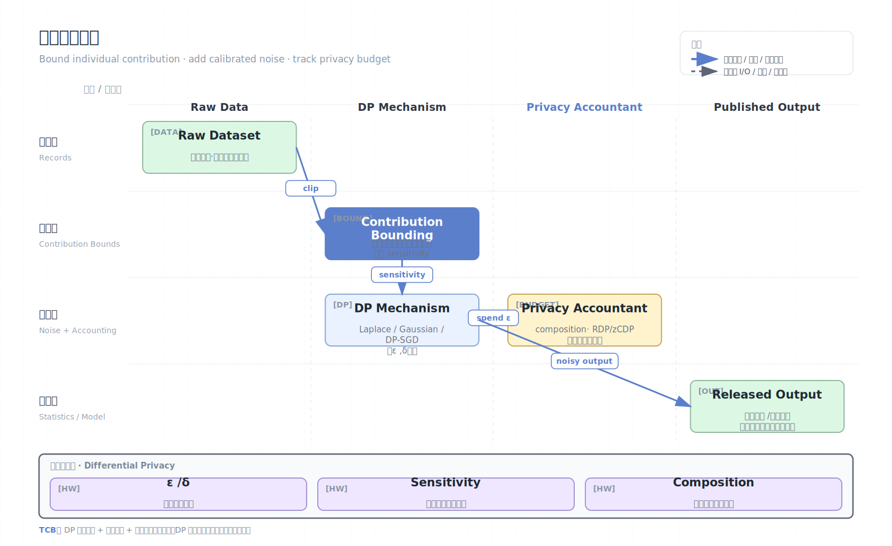

# 差分隐私

差分隐私（Differential Privacy, DP）是一种数学隐私定义，用于限制单个个体数据对统计输出或模型参数的影响。它常用于发布统计数据、训练机器学习模型、联邦学习和数据 clean room 场景。与加密不同，DP 关注“输出还能推断出多少个体信息”。

## 架构图


## 核心概念

- 邻接数据集：只相差一个个体记录的两个数据集。
- 隐私预算 epsilon：越小隐私越强，噪声越大，精度通常越低。
- delta：允许极小概率的隐私失败，形成 `(epsilon, delta)-DP`。
- Sensitivity：单个记录变化对查询结果的最大影响。
- Noise mechanism：根据 sensitivity 和预算添加 Laplace、Gaussian 等噪声。
- Composition：多次查询会累计消耗隐私预算。

## 工作原理

一个机制满足差分隐私，意味着攻击者看到输出后，很难判断某个个体是否在数据集中。直观上，加入或删除某个人的数据，输出分布变化被限制在可量化范围内。

典型步骤：

1. 定义允许的查询或训练任务。
2. 分析 sensitivity，限制单个样本最大贡献。
3. 根据 epsilon/delta 添加噪声。
4. 记录每次查询或训练轮次消耗的隐私预算。
5. 当预算耗尽时停止发布或重新获取授权。

在机器学习中，DP-SGD 通常先裁剪每个样本梯度，再向聚合梯度加入噪声，从而限制单个样本对模型的影响。

## 形式化直觉

一个随机机制 `M` 满足 `(epsilon, delta)-DP`，直观含义是对任意只差一个人的数据集 `D` 和 `D'`，输出落在任意集合 `S` 的概率满足近似约束：

```text
Pr[M(D) in S] <= exp(epsilon) * Pr[M(D') in S] + delta
```

epsilon 越小，两个输出分布越接近，单个个体是否参与越难判断。delta 通常应远小于数据集规模倒数，表示极小概率的失败项。

## Sensitivity 与机制选择

噪声大小取决于 sensitivity：

- Count query：单个用户最多改变 1，sensitivity 通常为 1。
- Sum query：必须限制每个用户贡献上限，否则 sensitivity 无界。
- Mean query：需要裁剪范围并限制每人贡献次数。
- Histogram：需要定义一个用户能影响多少 bucket。

常见机制：

| 机制 | 适合 | 说明 |
| --- | --- | --- |
| Laplace | 纯 epsilon-DP 的数值查询 | 噪声按 L1 sensitivity |
| Gaussian | `(epsilon, delta)-DP` | 常用于 DP-SGD |
| Exponential mechanism | 私有选择/排序 | 按 utility 采样 |
| Sparse vector | 多查询阈值检测 | 控制超过阈值的信息泄露 |

没有贡献边界就没有可控 DP。工程中最重要的往往是 contribution bounding，而不是加噪代码。

## 隐私预算会计

多次发布会累积隐私损失。常见会计方式：

- Basic composition：简单累加 epsilon，保守但易懂。
- Advanced composition：给出更紧的组合界。
- RDP/zCDP/moments accountant：机器学习中常用，便于跟踪 DP-SGD 多轮训练。
- Privacy filter/odometer：动态停止或记录预算消耗。

生产系统需要一个预算账本，记录谁、何时、对哪个数据集、用什么机制消耗了多少预算。否则分析师可以通过重复查询慢慢耗尽隐私。

## DP-SGD 训练细节

DP-SGD 的关键步骤：

1. 对每个样本计算梯度。
2. 按 L2 norm 裁剪到阈值 `C`。
3. 对裁剪后梯度求和或平均。
4. 加入 Gaussian noise。
5. 用 privacy accountant 计算累计 epsilon/delta。

调参取舍：

- 裁剪阈值低：隐私好但训练信号损失大。
- 噪声高：隐私好但精度下降。
- batch 大小、采样率、训练轮数影响预算。
- 大模型可能需要预训练、微调、adapter 或只训练小部分参数。

## 中心化与本地差分隐私

- Central DP：可信数据处理方看到原始数据，在发布结果时加入噪声。精度较好，但需要信任处理方。
- Local DP：数据在离开用户设备前已随机化。服务端不见原始数据，但噪声更大，效用较低。
- Distributed/Federated DP：结合安全聚合和联邦学习，让服务器只看到带噪聚合更新。

## 安全边界

差分隐私能帮助：

- 抵御重识别和成员推断。
- 量化隐私损失，而不是只给模糊承诺。
- 在发布统计或模型时控制个体影响。

差分隐私不能自动解决：

- 原始数据在处理前的访问控制。
- 小 epsilon 之外的业务合规承诺。
- 查询设计错误导致的低效用或输出泄露。
- 非个体级秘密，例如公司整体机密。
- 恶意分析师绕过预算系统直接看原始数据。

## DP 与攻击类型

DP 主要缓解：

- Membership inference：判断某个样本是否在训练集。
- Differencing attack：通过多次统计差分推断个体。
- Linkage/re-identification：把发布结果与外部数据连接。
- Memorization：模型记住罕见训练样本。

但 DP 不是万能匿名化。若输出本身是某个小群体统计，或业务允许过多切片查询，即使满足较弱 DP 也可能效用/隐私不达标。

## 工程治理

- 限制每个用户贡献次数和贡献值范围。
- 对低基数人群设置阈值，不发布过小群体结果。
- 预算按数据集和用户级别管理，不能只按查询管理。
- 把 DP 参数、delta 选择、会计方法写入审计文档。
- 对发布结果做效用评估，避免噪声太大导致误导。
- 与访问控制结合，防止绕过 DP 直接读取原始数据。

## 常见误区

- “加了噪声就是 DP”：只有按 sensitivity、预算和机制证明添加的噪声才是 DP。
- “epsilon 越大越好”：epsilon 大意味着隐私弱，不能只看模型精度。
- “DP 让数据匿名”：DP 是输出机制属性，不是数据脱敏格式。
- “一次证明永久安全”：多次发布会组合消耗预算。

## 与其他技术的关系

TEE/MPC/FHE 保护计算过程中的访问；差分隐私保护结果发布后的推断风险。实际系统常组合使用：TEE 或 MPC 保护原始数据处理，DP 约束最终统计或模型输出。

## 适用场景

- 人口统计和公共数据发布。
- 产品遥测和指标分析。
- 联邦学习模型训练。
- 数据 clean room 查询结果发布。
- 机器学习成员推断风险缓解。

## 参考资料

- NIST differential privacy blog: https://www.nist.gov/blogs/cybersecurity-insights/getting-started-differential-privacy
- The Algorithmic Foundations of Differential Privacy: https://www.cis.upenn.edu/~aaroth/Papers/privacybook.pdf
- OpenDP: https://opendp.org/
- TensorFlow Privacy: https://github.com/tensorflow/privacy
