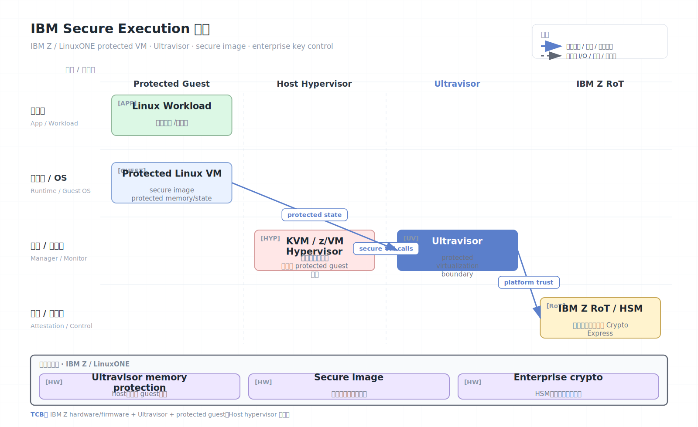

# IBM Secure Execution for Linux

IBM Secure Execution for Linux 是 IBM Z 和 LinuxONE 平台上的机密计算能力，用于运行受保护的 Linux 虚拟机。它的目标是在大型机虚拟化环境中保护 guest 内存和状态，使云管理员、host hypervisor 或其他高权限软件无法读取受保护 VM 的明文。

## 架构图


## 核心概念

- Protected VM：启用 Secure Execution 的受保护 Linux 虚拟机。
- Ultravisor：IBM Z 平台中位于 hypervisor 之下的可信保护层，用于隔离 protected guest。
- Secure image：经过加密和签名的 guest 镜像，只有符合平台安全条件时才能启动。
- Host hypervisor：可以是 KVM 或 z/VM，负责调度和资源管理，但不应访问 protected guest 明文。
- Attestation/verification：验证启动镜像、平台和保护状态，再释放密钥。

## 工作原理

Secure Execution 把虚拟机保护逻辑放入 IBM Z 硬件和固件支持的安全层。Host hypervisor 仍管理虚拟化资源，但当 guest 进入 protected 状态后，guest 内存受到硬件和 ultravisor 保护。Host 不能读取 guest 明文内存，也不能任意注入或修改受保护状态。

部署通常包括：

1. 生成受保护 guest 镜像，并把敏感启动材料加密。
2. 在 IBM Z/LinuxONE 上通过 KVM 或 z/VM 启动 protected VM。
3. 平台验证镜像和安全状态。
4. 受保护 guest 获取运行所需密钥。
5. Guest 在机密边界内处理数据。

IBM Z 的优势是成熟的企业级虚拟化、硬件安全模块和高可靠平台能力。Secure Execution 把这些能力带入 confidential VM 模型。

## Ultravisor 模型

Secure Execution 的关键抽象是 ultravisor。它位于普通 hypervisor 之下、硬件之上，负责执行 protected guest 的安全状态转换。可以粗略理解为：

```text
Protected Linux guest
  -> runs as secure/protected VM

KVM or z/VM hypervisor
  -> schedules and manages resources
  -> cannot inspect protected guest plaintext

Ultravisor + IBM Z firmware/hardware
  -> protects memory, CPU state, image secrets
  -> enforces protected virtualization boundary
```

这和 TDX/CCA 的设计思想相似：保留 hypervisor 的资源管理能力，但把机密性和完整性相关的操作放到更可信层。

## Secure image 与启动材料

Secure Execution 通常依赖受保护镜像格式。镜像不是简单地“开机后再加密”，而是在启动前就把敏感启动材料加密并绑定到平台保护机制。

典型流程：

1. 镜像发布者准备 Linux guest 镜像。
2. 对启动参数、初始 ramdisk、密钥材料或配置进行加密/签名。
3. Host 启动 protected VM，但无法解密敏感镜像内容。
4. Ultravisor/hardware 验证镜像保护结构。
5. Guest 在 protected 状态中解密并继续启动。

这里的核心目标是防止 host 在启动前篡改镜像或读取注入的 secret。与普通全盘加密不同，密钥释放不是交给 host，而是由 protected virtualization 边界控制。

## 与 IBM Z 安全生态的关系

IBM Z/LinuxONE 常与以下能力组合：

- Secure Boot 和固件信任链。
- Crypto Express/HSM 类硬件密钥保护。
- z/VM 或 KVM 企业虚拟化。
- Hyper Protect Services/Virtual Servers。
- 企业审计、合规和主机分区管理。

Secure Execution 的价值在于把 confidential VM 与这些大型机安全/合规能力结合。它不是为移动设备或小型 enclave 设计的，而是面向长期运行的企业 Linux workload。

## 证明与密钥策略

实际部署时应明确：

- 镜像由谁签名。
- 哪些启动参数进入保护/度量。
- 运行平台和固件级别是否满足合规要求。
- 应用密钥是否只在 protected guest 内解封。
- 运维流程是否禁止 host 侧 dump 明文内存。

如果使用云服务包装层，还要检查该服务如何暴露 attestation、如何与 KMS/HSM 集成、如何处理镜像升级和回滚。

## 安全模型

Secure Execution 通常信任：

- IBM Z/LinuxONE 硬件、固件、ultravisor 和启动链。
- Protected VM 镜像、guest OS 和应用。
- 镜像签名者、密钥管理和 attestation policy。

通常不信任：

- Host hypervisor 管理员。
- Host OS、普通运维工具和同机 workload。
- 外部存储、网络和不可信 I/O。

## 安全边界与限制

- VM 内 OS 和应用仍属于 TCB；guest 内漏洞仍可泄露秘密。
- Hypervisor 仍可拒绝服务或影响调度。
- I/O 需要独立加密和完整性保护。
- 安全属性强依赖 IBM Z 平台、固件级别、Linux 发行版和云服务配置。
- 与 x86/Arm confidential VM 的证明格式和运维生态不同，跨平台迁移需要重新设计。
- Host 侧备份、监控、dump、debug 工具需要 protected-VM-aware 流程，否则可能失败或破坏安全假设。
- Protected guest 内部仍要自己做磁盘、网络和应用层加密认证。
- 镜像签名和密钥注入流程是供应链关键点。
- 侧信道和资源争用不因大型机平台而自动消失。

## 与 TDX/SEV-SNP 的对比

| 维度 | IBM Secure Execution | TDX/SEV-SNP |
| --- | --- | --- |
| 平台 | IBM Z / LinuxONE | x86 云服务器 |
| 可信管理层 | Ultravisor + IBM Z 固件/硬件 | TDX Module 或 AMD SP/RMP |
| 粒度 | Protected Linux VM | Confidential VM |
| 生态 | 大型机企业安全、HSM、z/VM/KVM | 公有云 IaaS/Kubernetes |
| 迁移 | 适合 IBM Z workload | 适合通用 x86 workload |

## 适用场景

Secure Execution 适合金融、政府、主机现代化、核心交易系统、合规要求高的 IBM Z/LinuxONE 工作负载。若企业已经运行在 IBM Z 生态，它可以作为机密计算优先选项；若目标是通用公有云迁移，可对比 Azure/GCP 上的 TDX/SEV-SNP。

## 参考资料

- IBM Secure Execution documentation: https://www.ibm.com/docs/en/linux-on-systems?topic=virtualization-secure-execution-linux
- IBM Hyper Protect Virtual Servers: https://www.ibm.com/products/hyper-protect-virtual-servers
- Linux on IBM Z: https://www.ibm.com/linuxone
