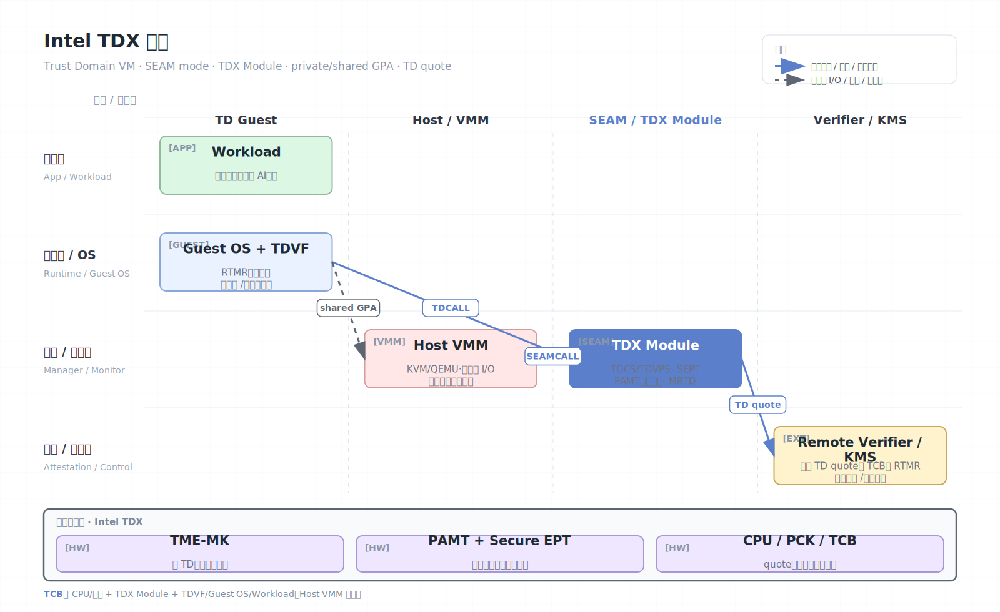

# Intel TDX

Intel Trust Domain Extensions（TDX）是 Intel 面向云和虚拟化环境的 VM 级机密计算技术。它把一台虚拟机运行在 Trust Domain（TD）中，目标是在不大改应用的前提下，保护 VM 内存和 CPU 状态免受宿主机 VMM、hypervisor、host OS、云管理员和部分物理内存攻击的读取或篡改。

## 架构图


## 核心概念

- TD（Trust Domain）：受 TDX 保护的机密虚拟机。
- TDX Module：由 CPU 度量的软件模块，运行在 SEAM（Secure Arbitration Mode）中，管理 TD 生命周期。
- SEAMRR：为 TDX Module 保留的内存范围。
- Private/Shared GPA：TD 内存分为私有页和共享页，共享页用于与不可信 VMM 或设备交互。
- Secure EPT/PAMT：用于绑定、跟踪和保护 TD 私有页的页表与元数据。
- TDREPORT/Quote：TD 生成本地报告，再由 quote 机制转换为远程可验证证明。

## 工作原理

TDX 复用现有虚拟化模型，但把最敏感的 VM 状态交给 CPU 和 TDX Module 管理。普通 VMM 仍负责调度 vCPU、分配资源、处理 I/O 和设备模拟，但不能直接访问 TD 私有内存，也不能任意修改 TD CPU 状态。

TDX 的内存保护依赖多层机制：

- Intel TME-MK 为不同安全域提供内存加密密钥。
- TD 私有页用 TD 绑定的密钥加密。
- GPA shared bit 标识某个 guest physical address 是私有通信还是共享通信。
- Secure EPT 和 PAMT 防止 VMM 把物理页错误映射、重复映射或伪装成 TD 私有页。
- TD exit/entry 过程中，CPU 状态由 TDX Module 保存和恢复，减少对 VMM 的暴露。

启动时，TDVF（TD Virtual Firmware）和初始内存会被度量。运行中，RTMR 等可扩展寄存器可记录后续启动链、内核、initrd、策略等状态。远程方应把密钥释放绑定到这些度量，而不是只检查“是否是 TDX”。

## 关键架构组件

TDX 可以理解为把传统 VMX 虚拟化拆成两层控制：VMM 仍管理资源，TDX Module 负责不允许 VMM 直接触碰的安全状态。

```text
TD guest:      TDVF -> guest kernel -> workload
TDX Module:   TD lifecycle, SEPT, PAMT, TDCS/TDVPS, measurement
CPU/microcode: SEAM mode, memory encryption keys, VM entry/exit enforcement
Host VMM:      scheduling, shared memory, device emulation, I/O
```

几个核心对象：

| 对象 | 作用 |
| --- | --- |
| TDCS | Trust Domain Control Structure，保存 TD 全局控制状态 |
| TDVPS | TD virtual processor state，保存 vCPU 相关受保护状态 |
| PAMT | Physical Address Metadata Table，记录物理页类型、owner 和状态 |
| SEPT | Secure EPT，TD 私有地址转换的受保护扩展页表 |
| TDR | TD root metadata，关联 TD 管理结构 |
| TDVF | TD Virtual Firmware，负责 TD 内早期启动和测量扩展 |

### SEAMCALL 与 TDCALL

TDX 的接口也分两类，和 CCA 的 RMI/RSI 很像：

| 接口 | 调用方 | 被调用方 | 用途 |
| --- | --- | --- | --- |
| SEAMCALL | Host VMM | TDX Module | 创建 TD、添加页、初始化 vCPU、调度 TD |
| TDCALL | TD guest | TDX Module | 获取 TD 信息、接受页面、转换共享/私有内存、生成报告 |

SEAMCALL 面向不可信 VMM，因此 TDX Module 会检查页所有权、生命周期、度量状态和权限。TDCALL 面向 TD guest，用于 TD 自己管理与安全边界相关的动作。

## TD 生命周期

一个 TD 的生命周期通常包括：

1. **创建 TD 元数据**：VMM 通过 SEAMCALL 创建 TDR/TDCS，设置 TD attributes、XFAM、最大 vCPU、地址宽度等。
2. **构建初始内存**：VMM 添加 TDVF、初始页和配置页。TDX Module 记录页面内容和属性，形成 MRTD。
3. **初始化 vCPU**：创建 TDVPS，设置初始执行状态。
4. **Finalize**：TD 构建结束后，初始 measurement 固化。此后 VMM 不能再静默改初始镜像。
5. **TD 启动**：VMM 调度 TD vCPU。TDVF 执行 Secure Boot、测量扩展、启动 guest kernel。
6. **Guest 接受页面**：TD 内部通常需要通过 TDCALL 接受动态分配页面，防止 host 偷塞未确认内存。
7. **运行时转换**：TD 可把页面在 private/shared 之间转换，用于 virtio、网络和磁盘 I/O。

这条链路的重点是：host 仍提供资源，但 TD 必须显式接受资源，TDX Module 负责保证资源状态与度量/权限一致。

## 私有页、共享页与 I/O

TDX 中的 guest physical address 通常通过 shared bit 区分私有和共享语义：

- **Private GPA**：由 TD 私有密钥加密，受 SEPT/PAMT 保护，host 不能直接读写明文。
- **Shared GPA**：用于与 VMM、virtio 设备、emulated device、网络/磁盘后端通信，host 可以访问，TD 必须视为不可信。

因此 TDX 应用设计里常见两条数据路径：

```text
私有路径：密钥、明文数据、模型权重、数据库页、应用堆栈
共享路径：virtio ring、DMA bounce buffer、配置空间、host call buffer
```

只要数据进入共享页，就离开了 TDX 私有边界。磁盘和网络必须有 guest 内端到端加密和认证；不要把“VM 是 TDX”误解为“外部存储自然可信”。

## 远程证明

TD 内部先生成 TDREPORT，报告包含 TD 度量、配置、安全属性和调用方提供的数据。随后通过平台 quote 服务生成可远程验证的 quote。Verifier 需要检查：

- CPU 和 TDX Module 的身份、版本和 TCB 状态。
- TD 度量、RTMR、TD attributes 是否符合预期。
- Quote 中绑定的 nonce 或临时公钥是否匹配当前会话。
- 云平台和证书链是否满足自己的信任策略。

只有证明通过后，KMS、secret manager 或数据提供方才应释放工作负载密钥。

TDX 度量通常需要区分：

- **MRTD**：TD 构建期初始内容度量。
- **RTMR**：运行时可扩展度量，可记录 TDVF、Secure Boot、kernel、initrd、命令行、策略等。
- **Attributes/XFAM**：TD 是否允许 debug、哪些扩展状态可用等。
- **TCB status**：CPU、微码、TDX Module、PCK/PCS collateral 是否处于合格状态。

密钥释放建议绑定 `quote nonce + TD measurement + RTMR + attributes + TCB minimum + workload public key`。只绑定 MRTD 往往不足以区分同一固件启动的不同 kernel 或策略。

## 安全模型

TDX 通常信任：

- Intel CPU、微码、TDX Module、平台固件和 attestation 根。
- TDVF、guest kernel、guest userspace 和工作负载自身。
- Verifier 侧的 attestation policy。

TDX 通常不信任：

- VMM、host OS、host 管理员。
- 云平台普通运维面和同机租户。
- 共享内存、虚拟设备、外部网络与存储。

## 安全边界与限制

- TDX 主要保护 TD 私有内存和 CPU 状态，不保证所有设备 I/O 都可信。
- Host 仍控制调度和资源，因此可实施拒绝服务、降速、中断风暴或异常注入类攻击面。
- 侧信道仍需缓解，包括缓存、分支预测、内存访问模式、计时和共享资源争用。
- VM 级 TCB 大于应用级 enclave。Guest OS、驱动和服务漏洞仍在信任边界内。
- 共享页是必要通信机制，必须按不可信输入处理，避免把秘密放入共享缓冲区。
- 证明策略必须包含版本和补丁状态，否则“真实 TDX 平台”不等于“足够安全的平台”。
- TD 内 guest kernel、驱动和 agent 是 TCB。TDX 不能防 guest 内提权或应用 RCE。
- Debug TD、测试 key、过宽松 attestation policy 会直接削弱安全边界。
- Snapshot、migration、crash dump 和 memory ballooning 需要 TDX-aware 支持，否则可能泄露或破坏状态。
- TDX 与 GPU、NIC、NVMe 等设备的端到端保护依赖 PCIe IDE、TDISP、IOMMU 和云平台支持，不能默认假设。

## 与 SGX/SEV-SNP/CCA 的对比

| 项目 | TDX | 对照 |
| --- | --- | --- |
| 保护粒度 | 整个 VM/TD | 比 SGX 更易迁移，但 TCB 更大 |
| 内存机制 | TME-MK + PAMT + SEPT | 和 SEV-SNP 的 RMP 类似，都是约束 host 映射能力 |
| 管理接口 | SEAMCALL/TDCALL | 类似 CCA 的 RMI/RSI |
| 度量 | MRTD + RTMR | 类似 SGX MRENCLAVE、CCA Realm measurement |
| 证明 | TDREPORT -> Quote | 与 Intel DCAP/Trust Authority 生态结合 |
| I/O | 共享页 + 设备扩展 | 与所有 VM 级 TEE 一样是主要难点 |

## 适用场景

TDX 适合把现有 Linux/Windows 服务迁移到机密 VM，尤其是数据库、AI 推理、企业应用和合规型云迁移。若需要更小 TCB，可把关键逻辑拆到 SGX/Nitro Enclave；若需要跨组织联合计算，可组合 TDX 与 Confidential Space、MPC 或差分隐私。

## 参考资料

- Intel TDX overview: https://www.intel.com/content/www/us/en/developer/tools/trust-domain-extensions/overview.html
- Intel Trust Authority: https://www.intel.com/content/www/us/en/security/trust-authority.html
- Google Confidential VM TDX overview: https://docs.cloud.google.com/confidential-computing/confidential-vm/docs/confidential-vm-overview
