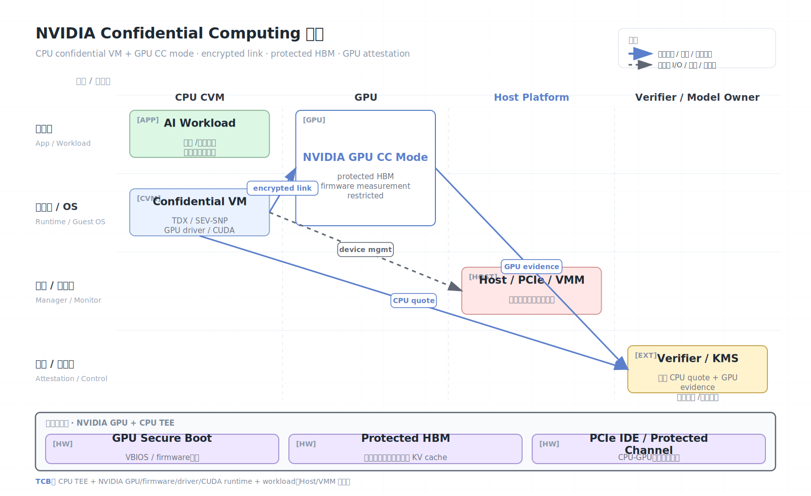

# NVIDIA Confidential Computing

NVIDIA Confidential Computing 把机密计算边界扩展到 GPU，主要面向 AI/ML 加速负载。传统 CPU TEE 可以保护 guest CPU 内存，但当模型和数据进入 GPU HBM、驱动和 PCIe 传输路径时，安全边界会被拉宽。NVIDIA Hopper H100 及后续平台提供 GPU 侧安全启动、内存保护、链路加密和 attestation 能力，用于保护敏感模型和数据在 GPU 上的使用中状态。

## 架构图


## 核心概念

- GPU CC mode：GPU 进入机密计算模式，限制调试和管理访问。
- Secure boot/firmware measurement：GPU 固件和启动状态可被度量。
- Attestation：验证 GPU 身份、固件版本、CC 模式和安全属性。
- Encrypted link：CPU TEE 与 GPU 之间的数据传输可加密保护。
- Protected HBM：GPU 本地显存中的模型权重、中间张量和数据受保护。
- nvtrust：NVIDIA 提供的证明、验证和部署工具集合。

## 工作原理

GPU 机密计算通常不是单独存在，而是与 CPU 侧 confidential VM 组合使用。一个典型部署会使用 AMD SEV-SNP 或 Intel TDX 保护 VM，随后把 NVIDIA GPU 置于 CC 模式，并让工作负载验证 CPU TEE 与 GPU attestation 都满足策略。

关键路径包括：

1. VM 启动并通过 CPU TEE attestation。
2. GPU 固件安全启动，进入 CC 模式。
3. 工作负载验证 GPU attestation evidence。
4. CPU TEE 与 GPU 建立受保护通道。
5. 模型和数据以加密形式穿过不可信 host 路径。
6. GPU 在受保护 HBM 中执行推理或训练。

对 AI 场景而言，保护对象不仅是用户输入，还包括模型权重、prompt、中间激活、embedding、梯度和推理结果。

## 端到端边界

GPU 机密计算要解决的是“CPU TEE 到加速器之间的边界断裂”。如果 VM 内存受 TDX/SEV-SNP 保护，但模型权重通过 host driver 或 PCIe 明文进入 GPU，那么 GPU 前后的路径仍可能泄露。

一个完整保护链通常包括：

```text
Remote verifier / model owner
  -> verifies CPU confidential VM attestation
  -> verifies GPU CC attestation
  -> releases model/data key
  -> guest decrypts inside CVM
  -> encrypted/protected channel to GPU
  -> GPU computes in protected HBM
```

需要同时回答：

- CPU VM 是否真在合格 TEE 中。
- GPU 是否真在 CC mode 中。
- GPU firmware/VBIOS/driver/runtime 是否处于允许版本。
- CPU-GPU 传输路径是否启用加密或受保护机制。
- GPU 内存、多租户分区、debug/profiling 是否符合策略。

只验证 CPU 或只验证 GPU 都不够，因为明文会跨越两者。

## GPU Attestation 与 nvtrust

NVIDIA 的可信计算栈会提供 GPU 身份、固件、CC mode、驱动栈和相关安全属性的证明材料。验证策略通常应包含：

- GPU 型号和架构是否支持目标 CC 功能。
- VBIOS、firmware、GSP/安全处理器状态。
- CC mode 是否启用，debug/profiling 是否受限。
- 驱动和 CUDA 栈版本是否在支持矩阵内。
- 证明 nonce 或会话公钥绑定，防止重放。

在云上还要把 GPU evidence 与实例类型、CPU TEE quote、镜像 digest、KMS policy 关联。否则攻击者可能用“合格 GPU + 不合格 VM”或“合格 VM + 不合格 GPU 路径”绕过端到端策略。

## AI 工作负载特殊风险

与传统密钥服务相比，机密 AI 的输出面更复杂：

- Prompt、system prompt、RAG 文档和工具调用参数可能进入 GPU 中间状态。
- 模型权重可能是商业秘密，需要防 host 复制。
- Batch 推理中不同租户数据可能共享 GPU 资源。
- 中间激活和 KV cache 可能包含可恢复用户信息。
- 输出可能泄露训练数据、提示词或检索文档。

GPU CC 保护的是硬件/运行时访问路径，不会自动提供模型隐私、成员推断防护、prompt injection 防护或输出审查。常见组合是 GPU CC + CPU CVM + 模型水印/访问控制 + DP/安全日志策略。

## 部署检查清单

- 实例是否支持 CPU TEE 与 GPU CC 的组合。
- Guest kernel、驱动、CUDA、container runtime 是否是受支持版本。
- 是否能在 workload 内验证 GPU attestation，而不是只相信云控制台。
- KMS 是否同时绑定 CPU quote 和 GPU evidence。
- 是否禁用或限制调试、profiling、performance counter、core dump。
- 是否避免把明文模型写入普通磁盘、日志或共享内存。

## 安全模型

NVIDIA GPU CC 通常信任：

- 支持 CC 的 NVIDIA GPU、VBIOS、固件和硬件根。
- CPU 侧 TEE（TDX/SEV-SNP 等）和 guest OS。
- NVIDIA 驱动、CUDA 版本、nvtrust 工具和证明策略。

通常不信任：

- Host hypervisor、host OS、云管理员。
- 普通 PCIe 路径上的观察者。
- 同机其他租户或非授权管理工具。

## 安全边界与限制

- 需要检查支持矩阵。GPU 型号、VBIOS、驱动、CUDA、云实例和 CC 模式必须匹配。
- CPU TEE 与 GPU TEE 都要证明；只证明其中一个通常不足以保护端到端数据流。
- GPU 侧机密计算不自动防止模型通过输出泄露训练数据或 prompt。
- 侧信道、性能计数器、资源争用和多租户 MIG 的边界需要结合文档和云平台配置评估。
- 驱动和运行时仍是大 TCB 的一部分，供应链和版本管理很重要。
- GPU CC 不保证模型输出不泄露训练数据或 prompt。
- Host 仍可拒绝服务、改变调度、影响带宽和观察粗粒度元数据。
- 多 GPU、NVLink、RDMA、存储直连会扩大证明和设备信任边界。
- 机密训练还要考虑 checkpoint、梯度、optimizer state 和数据加载管道。

## 适用场景

NVIDIA Confidential Computing 适合机密 AI 推理、专有模型托管、医疗/金融数据 GPU 分析、多方模型评估和需要保护 GPU 中间状态的任务。若只处理 CPU 数据，可先评估 TDX/SEV-SNP；若要在不信任任何硬件供应商的前提下计算，应研究 FHE/MPC，但当前性能差异显著。

## 参考资料

- NVIDIA Trusted Computing Solutions: https://docs.nvidia.com/nvtrust/index.html
- NVIDIA H100 architecture whitepaper: https://resources.nvidia.com/en-us-tensor-core
- Google Confidential VM with NVIDIA CC: https://docs.cloud.google.com/confidential-computing/confidential-vm/docs/confidential-vm-overview
