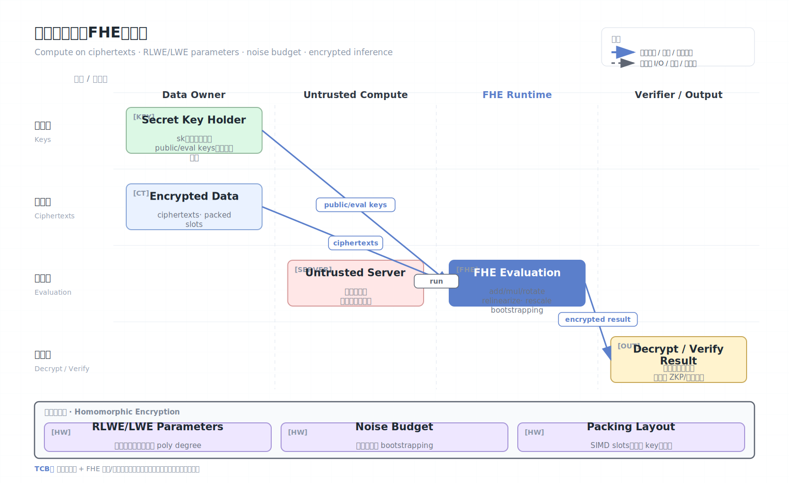

# 全同态加密（FHE）

同态加密允许在密文上执行计算，解密计算结果后得到与明文计算相同或近似的结果。全同态加密（Fully Homomorphic Encryption, FHE）进一步允许对任意可表示的电路进行计算，是“数据始终保持加密”的重要隐私计算技术。

## 架构图

## 核心概念

- Plaintext：原始数据。
- Ciphertext：加密后的数据，可被服务器计算。
- Evaluation：服务器在不知道明文和私钥的情况下执行加法、乘法或门电路。
- Secret key：通常只由数据拥有方持有，用于最终解密。
- Noise budget：密文中噪声会随计算增长，超过阈值后无法正确解密。
- Bootstrapping：刷新密文、降低噪声，使更深计算成为可能。

## 常见方案

- BFV/BGV：适合精确整数或模整数计算。
- CKKS：适合近似实数/复数计算，常用于机器学习和统计。
- TFHE/FHEW：适合布尔门或低延迟 bootstrapping。

不同方案的编码、误差、乘法深度、打包能力和性能差异很大。FHE 工程通常不是“把现有程序直接加密运行”，而是把算法重写成适合 FHE 的低深度电路。

## 工作原理

多数现代 FHE 基于 LWE/RLWE 等格困难问题。加密后，密文保留某种代数结构，使得：

- 密文加法对应明文加法。
- 密文乘法对应明文乘法，但会增加噪声和密文复杂度。
- Relinearization/Galois keys 支持乘法后降维、旋转和 SIMD packing。
- Bootstrapping 可同态执行“解密电路”，把噪声大的密文刷新为噪声小的密文。

CKKS 常通过近似编码把向量打包进一个密文，使用旋转、加法、乘法实现线性代数。代价是结果存在数值误差，需要管理 scale、level 和 rescale。

## 参数与噪声管理

FHE 工程的核心不是 API 调用，而是参数管理：

| 参数/概念 | 影响 |
| --- | --- |
| Polynomial modulus degree | 安全级别、吞吐、内存 |
| Coefficient modulus chain | 可支持乘法深度 |
| Plaintext modulus | BFV/BGV 的明文空间 |
| Scale | CKKS 精度和 rescale 策略 |
| Multiplicative depth | 是否需要 bootstrapping |
| Security level | 通常目标 128-bit 级别或更高 |

每次乘法都会消耗 level/噪声预算。若电路深度超过预算，解密会失败或 CKKS 误差不可接受。优化目标通常是把算法改写成低乘法深度、少旋转、可 SIMD packing。

## SIMD Packing 与旋转

现代 FHE 的实用性很大程度来自 batching/packing：一个 ciphertext 中打包多个 slot，同一条同态操作并行作用于多个数据。常见于矩阵乘、卷积、统计聚合。

但 packing 带来新的工程问题：

- slot 布局决定旋转次数。
- 旋转需要 Galois keys，key size 可能很大。
- 不同样本打包在一起时，要防止输出组合泄露额外关系。
- 稀疏访问和条件分支很难高效表达。

## Key switching、Relinearization、Bootstrapping

FHE 计算常见辅助操作：

- **Relinearization**：乘法后密文维度增加，需要降回较小维度。
- **Key switching**：把一个 key 下的密文转换到另一个 key 相关形式。
- **Rotation**：SIMD slot 轮转，用于求和、矩阵乘和卷积。
- **Bootstrapping**：同态刷新噪声，支持无限深度或更深电路。

这些操作通常比加法昂贵得多，是性能调优重点。

## 可验证性问题

FHE 让服务器看不见输入，但不自动保证服务器算对了。恶意服务器可以：

- 跳过部分计算。
- 返回旧 ciphertext。
- 返回随机 ciphertext。
- 使用错误模型或错误参数。

解决方法包括 ZKP、可验证计算、重复计算、TEE 包裹执行、结果抽样校验或业务层一致性检查。

## 安全模型

FHE 通常信任：

- 数据拥有方私钥安全。
- 加密参数满足目标安全级别。
- 实现库正确处理随机数、参数、序列化和 side-channel。

FHE 通常不信任：

- 执行计算的服务器。
- 存储密文的云平台。
- 观察计算过程的外部攻击者。

## 安全边界与限制

- FHE 保护输入和中间值，但不自动保护输出。解密结果可能泄露敏感信息。
- 服务器可返回错误结果，除非结合可验证计算、ZKP、重复计算或审计。
- 计算电路、访问模式、密文大小、运行时间可能泄露元数据。
- 性能开销仍然显著，尤其是 bootstrapping 和深度神经网络。
- 参数选择很专业，错误参数会导致安全或正确性问题。
- CKKS 是近似计算，不适合要求逐 bit 精确的业务逻辑，除非设计可容忍误差。
- 密文访问模式、计算图和模型结构通常仍对服务器可见，除非再结合 ORAM/隐藏电路技术。
- 私钥持有方是强信任点；多方场景可能需要 threshold FHE。
- 解密 oracle 设计不当会导致 chosen-ciphertext 风险。
- 生产系统要处理密文版本、参数升级、key rotation 和灾备。

## 算法改写示例

普通机器学习函数常需要替换：

| 普通操作 | FHE 友好替代 |
| --- | --- |
| ReLU / max | 低阶多项式近似、平方激活、比较协议 |
| 浮点 softmax | 近似多项式、在明文侧后处理、改模型 |
| 动态分支 | 转成算术选择 `b*x + (1-b)*y` |
| 随机访问 | 线性扫描或预打包布局 |
| 深层网络 | 降低深度、量化、分块 bootstrapping |

FHE 选型前应先估算电路深度、旋转数、ciphertext 数量和允许误差，而不是直接把现有代码搬过去。

## 与 TEE 的比较

FHE 不需要信任硬件或云管理员，理论边界更“密码学纯粹”。但它的可计算范围和性能受限，通常需要算法重写。TEE 可以运行通用程序但需要信任硬件和较大的软件 TCB。实际系统可能组合二者：TEE 管理密钥和预处理，FHE 处理最敏感数据，ZKP 验证结果。

## 适用场景

- 加密数据统计。
- 隐私保护机器学习推理。
- 医疗或基因数据查询。
- 低频高价值的外包计算。
- 需要云端永不见明文的计算服务。

## 参考资料

- Homomorphic Encryption Standardization: https://homomorphicencryption.org/
- OpenFHE: https://openfhe.org/
- Microsoft SEAL: https://www.microsoft.com/en-us/research/project/microsoft-seal/
- Google FHE transpiler: https://github.com/google/fully-homomorphic-encryption
