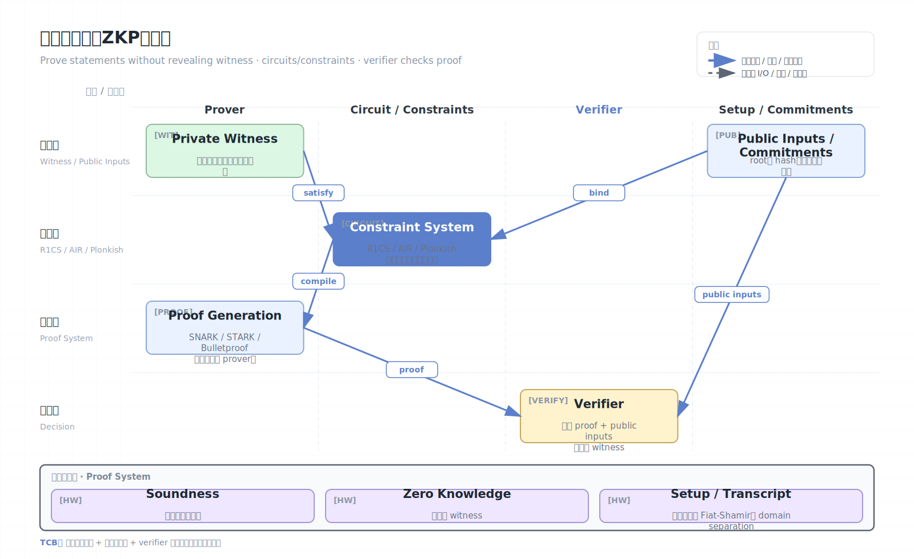

# 零知识证明（ZKP）

零知识证明（Zero-Knowledge Proof, ZKP）允许证明者向验证者证明某个陈述为真，同时不泄露证明该陈述所需的秘密见证。它不是直接“加密计算数据”的工具，而是“证明计算或关系正确”的工具，经常与区块链、身份、可验证外包计算、MPC 和 FHE 组合使用。

## 架构图


## 三个基本性质

- Completeness：若陈述为真，诚实证明者能让诚实验证者接受。
- Soundness：若陈述为假，恶意证明者很难让验证者接受。
- Zero-knowledge：验证者除了“陈述为真”外，学不到关于秘密见证的额外信息。

## 核心流程

许多现代 ZKP 系统会把程序转换成约束系统：

1. 把业务逻辑写成电路或中间表示。
2. 将计算转换为 R1CS、AIR、Plonkish 等约束。
3. 证明者用私有 witness 生成 proof。
4. 验证者使用公开输入、验证密钥和 proof 检查约束成立。

公开输入会被验证者看到，私有 witness 不会泄露。若业务把敏感信息放进公开输入，ZKP 不会替你隐藏。

## 约束系统视角

ZKP 的本质是证明“存在一个 witness，使得某组约束成立”。例如：

```text
public:  y
private: x
claim:   H(x) = y
```

证明者不公开 `x`，但证明自己知道某个 `x` 的哈希等于公开的 `y`。更复杂的程序会被编译成大量约束：

- R1CS：Rank-1 Constraint System，常见于 Groth16 等 SNARK。
- Plonkish：用门、selector、copy constraint 表示计算。
- AIR：Algebraic Intermediate Representation，常见于 STARK。
- zkVM trace：把 CPU/VM 每一步执行转换为可证明 trace。

约束数量、证明生成时间和内存占用通常比源代码行数更能反映成本。

## Proving key、verification key 与 setup

许多 SNARK 系统需要 setup：

- **Circuit-specific trusted setup**：每个电路一套参数；泄露 toxic waste 可能伪造 proof。
- **Universal setup**：一次 setup 支持一类电路，仍可能有 ceremony 信任假设。
- **Transparent setup**：不需要可信设置，常见于 STARK，但 proof 通常更大。

验证者不能只知道“用了 ZK”，还要知道使用的是哪套证明系统、setup 如何生成、验证 key 是否对应正确电路。

## 公开输入、私有 witness 和承诺

ZKP 系统常把数据分成：

- Public inputs：验证者可见，例如承诺值、根哈希、结果。
- Private witness：证明者隐藏的数据，例如秘密、路径、原始交易。
- Commitments：对私有数据的绑定，例如 Merkle root、Pedersen commitment。

隐私设计的关键是把“业务必须公开的信息”最小化。比如范围证明只公开“金额在范围内”，不公开金额本身；身份属性证明只公开“满足年龄条件”，不公开生日。

## 递归证明与聚合

递归 ZKP 允许证明“另一个 proof 验证通过”。用途包括：

- 把很多交易 proof 聚合成一个 proof。
- 把长程序分段证明，再递归压缩。
- 在链上只验证一个小 proof。
- 构造可组合的身份/合规证明。

代价是电路复杂度和实现风险上升。递归 proof 的 verifier circuit 必须正确约束底层 proof 验证逻辑。

## 常见类型

- zk-SNARK：证明短、验证快，常需要可信设置或通用设置，依赖椭圆曲线/配对等假设。
- zk-STARK：透明设置、通常被认为更抗量子，但 proof 较大。
- Bulletproofs：不需要可信设置，适合范围证明，但验证成本通常更高。
- zkVM：证明某段通用程序执行正确，例如 RISC-V/WASM 风格虚拟机。

## 安全模型

ZKP 通常信任：

- 证明系统的密码学假设。
- 可信设置过程（若使用需要 setup 的方案）。
- 电路/约束正确表达业务逻辑。
- 实现库没有随机数、side-channel、序列化和 verifier bug。

ZKP 不信任：

- 证明者。
- 外包计算方。
- 只看 proof 的 verifier 不需要重新执行完整计算。

## 安全边界与限制

- 电路错误是最大风险。若约束不足，恶意证明者可为错误陈述生成有效 proof。
- ZKP 不隐藏公开输入、输出、证明生成时间、证明大小等元数据。
- Soundness 不等于业务真实性。它只能证明“电路中的陈述”为真。
- 可信设置泄露可能破坏某些 SNARK 的安全。
- 证明生成成本可能很高，尤其是大模型、数据库查询和复杂程序。
- ZKP 证明的是形式化电路，不证明自然语言需求正确。
- Witness 生成器若有 bug，可能生成与业务预期不一致但满足约束的 witness。
- Verifier 必须检查所有 public inputs，遗漏一个可能导致 proof 被跨上下文复用。
- Fiat-Shamir transcript、domain separator、curve/hash 选择错误会破坏安全。

## 常见安全检查清单

- 电路是否约束了所有变量，没有 unconstrained witness。
- 是否检查范围，避免有限域 wrap-around。
- Public input 顺序和语义是否与 verifier 代码一致。
- Commitment 是否绑定正确 domain 和上下文。
- Proof 是否绑定 chain id、应用 id、nonce 或 session。
- Trusted setup 是否可审计，toxic waste 是否合理销毁。
- 随机数和 witness 是否不会写入日志或浏览器存储。

## 与 TEE/MPC/FHE 的关系

- TEE 保护运行时明文，ZKP 证明运行结果正确。
- MPC 保护多方输入，ZKP 可证明某方输入满足范围或合法性。
- FHE 保护密文计算，ZKP 可证明服务器按指定电路计算。
- 差分隐私限制输出泄露，ZKP 可证明噪声机制和预算消耗按规则执行。

## 适用场景

- 身份属性证明，例如证明年龄大于 18 而不公开生日。
- 区块链隐私交易和 rollup 有效性证明。
- 可验证数据库查询。
- 模型推理或风控规则的合规证明。
- MPC/FHE 协议中的输入合法性和结果正确性证明。

## 参考资料

- ZKProof Standards: https://zkproof.org/
- zkDocs: https://www.zkdocs.com/
- RISC Zero zkVM: https://www.risczero.com/
- StarkWare STARK resources: https://starkware.co/stark/
