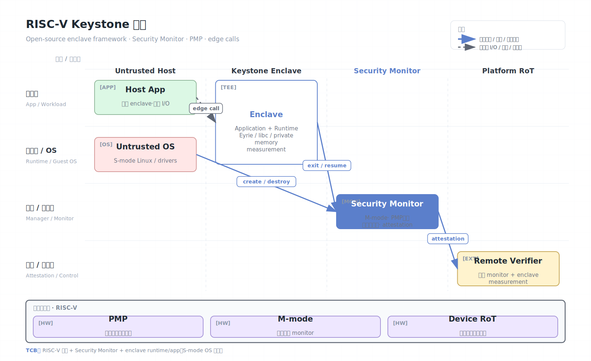

# RISC-V Keystone

Keystone 是一个开源的 RISC-V TEE 框架，用于构建可定制的 enclave。它更偏研究和系统构建框架，而不是单一厂商固定产品。Keystone 的目标是用简单硬件原语（例如 RISC-V privilege levels 和 PMP）构造可审计、可裁剪、可移植的可信执行环境。

## 架构图


## 核心概念

- Enclave：受保护的应用执行环境。
- Security Monitor：运行在最高特权层的可信组件，负责 enclave 创建、销毁、内存隔离和 attestation。
- PMP（Physical Memory Protection）：RISC-V 硬件内存访问控制机制，用于限制 S-mode OS 对 enclave 内存的访问。
- Runtime：enclave 内部运行时，向应用提供内存、系统调用代理和基础服务。
- Edge call：enclave 与不可信 host 之间的调用/通信机制。
- Measurement：enclave 初始内容和配置的哈希，用于远程证明。

## 工作原理

Keystone 的典型部署把普通 OS 放在 S-mode，把 Security Monitor 放在 M-mode。普通 OS 负责加载 enclave 镜像和分配资源，但在 enclave 进入运行态后，Security Monitor 通过 PMP 等机制让 OS 无法直接访问 enclave 私有内存。

生命周期大致如下：

1. Host 应用请求创建 enclave。
2. Security Monitor 分配并锁定 enclave 内存区域。
3. Enclave runtime 和应用被加载并度量。
4. Security Monitor 配置 PMP，阻止 OS 访问 enclave 区域。
5. CPU 在 host 和 enclave 之间切换。
6. Enclave 通过 edge call 请求外部 I/O，并把外部返回视为不可信输入。

Keystone 的一个特点是可定制。研究者可以替换 runtime、调整内存模型、添加加密内存、验证 monitor 或扩展硬件隔离策略。这使它非常适合探索 TEE 设计，而不局限于 SGX/TDX/SEV 这些闭源商业实现。

## 安全 Monitor 与 PMP 机制

Keystone 使用 RISC-V 的 M-mode 作为最高可信层。Security Monitor 的职责类似微型 TEE 内核：

- 管理 enclave 元数据和生命周期。
- 配置 PMP，把 enclave 物理内存从 S-mode OS 中隔离。
- 在 host 和 enclave 之间切换上下文。
- 生成并签署 attestation report。
- 控制 enclave 内存销毁和清理。

PMP 的关键作用是让 M-mode 给较低特权级设置物理访问规则。Host OS 即使管理页表，也不能访问被 PMP 标记为 enclave 私有的物理范围。

```text
M-mode: Security Monitor, platform key, PMP configuration
S-mode: untrusted OS, drivers, host runtime
U-mode: host app and enclave app/runtime
```

PMP region 数量有限，因此 Keystone 的内存布局、enclave 数量、共享缓冲区和动态分配策略都会受到硬件约束。生产级设计通常需要更强的内存加密、IOMMU 和调试锁定配合。

## Enclave 组成

Keystone enclave 通常不是只有业务程序，还包含：

| 组件 | 作用 |
| --- | --- |
| Enclave application | 业务可信代码 |
| Runtime | libc、内存管理、异常处理、系统调用代理 |
| Edge-call interface | 与 host 的调用和共享缓冲协议 |
| Eyrie 等 runtime | Keystone 常见可裁剪运行时 |
| Host shim | 创建 enclave、转发 I/O、管理生命周期 |

Runtime 是 TCB 的一部分。它越完整，移植越容易，但可信代码越多。研究中常用 Keystone 来比较“极小 runtime”和“类 LibOS runtime”的安全/兼容性取舍。

## 生命周期与内存布局

简化流程：

1. Host 分配一段连续或可描述的物理内存。
2. Security Monitor 验证并锁定该范围。
3. Runtime 和应用被加载，计算 measurement。
4. Monitor 配置 PMP，使 host 无法访问 enclave private region。
5. Enclave 执行，必要时通过共享 buffer 发起 edge call。
6. Enclave 退出或销毁时，Monitor 清理内存并撤销 PMP。

Keystone 通常区分：

- Private memory：enclave 代码、数据、堆栈、密钥。
- Shared memory：edge call 参数、I/O buffer、host 通信区。
- Untrusted memory：host OS 和普通应用空间。

共享内存必须做深拷贝和验证，原则与 SGX OCALL/ECALL 一样。

## 远程证明

Keystone attestation 依赖平台根密钥和 Security Monitor 对 enclave measurement 的签名。远程 verifier 应验证：

- 设备或平台证书链是否可信。
- Security Monitor 版本和度量是否符合预期。
- Enclave measurement 是否匹配目标应用。
- Quote 中的 nonce 或临时公钥是否绑定当前会话。

工程上，密钥释放应在 attestation 通过之后发生，并且只释放给 quote 绑定的 enclave 公钥。

一个更完整的证明策略应包含：

- Security Monitor measurement 和版本。
- Enclave runtime measurement。
- Enclave application measurement。
- 平台唯一身份或设备证书链。
- Nonce 或 verifier challenge。
- Enclave 内生成的临时公钥 hash。

如果 runtime 可配置，verifier 不能只检查应用 hash；runtime 的系统调用代理、内存分配器和 edge-call 处理同样会影响安全。

## 安全模型

Keystone 通常信任：

- RISC-V 硬件、PMP 实现、Boot ROM 和启动链。
- Security Monitor、enclave runtime 和 enclave 应用。
- 设备证明密钥和 verifier policy。

Keystone 通常不信任：

- S-mode OS、驱动、host 应用。
- 外部存储、网络、计时源和中断输入。
- 其他普通进程或 enclave 外部代码。

## 安全边界与限制

- PMP region 数量和粒度会限制 enclave 内存布局。
- 基础 Keystone 不自动提供强内存加密；离开芯片封装后的物理内存攻击需要平台扩展。
- I/O、文件系统和网络由不可信 host 代理，协议必须自行加密和认证。
- 侧信道、缓存争用、中断计时和页访问模式需要额外设计。
- 作为研究框架，生产使用需要严肃评估具体硬件、monitor、runtime 和供应链。
- Host 仍控制调度、I/O、时钟和中断，可做 DoS 和计时干扰。
- Security Monitor 是极高价值 TCB，漏洞会影响所有 enclave。
- 仅用 PMP 难以覆盖复杂 DMA 设备，需要 IOMMU 或设备隔离策略。
- 开源可审计不等于自动安全；具体 SoC、板级调试口和 boot chain 同样关键。

## 与 SGX/CoVE 的对比

| 维度 | Keystone | SGX | CoVE |
| --- | --- | --- | --- |
| ISA/平台 | RISC-V 开源生态 | Intel x86 | RISC-V confidential VM 标准方向 |
| 粒度 | 应用/runtime enclave | 应用 enclave | VM/TVM |
| 内存隔离 | PMP/monitor | EPC/EPCM/MEE | TSM/平台内存所有权 |
| 可定制性 | 很高 | 较低 | 取决于规范和实现 |
| 适合 | 研究、原型、可验证 TEE | 商业 enclave 应用 | 云/服务器 RISC-V |

## 适用场景

Keystone 适合 RISC-V TEE 研究、教学、开源硬件安全实验、可验证 monitor、边缘设备 enclave 原型。若目标是标准化的 RISC-V confidential VM，应关注 CoVE；若目标是成熟云服务，应选择 TDX/SEV-SNP/Azure/Google 等现有方案。

## 参考资料

- Keystone project: https://keystone-enclave.org/
- Keystone documentation: https://docs.keystone-enclave.org/
- Keystone paper: https://arxiv.org/abs/1907.10119
