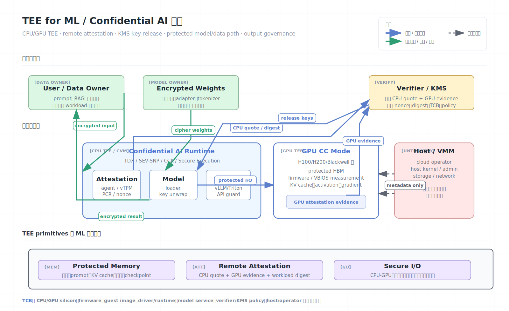
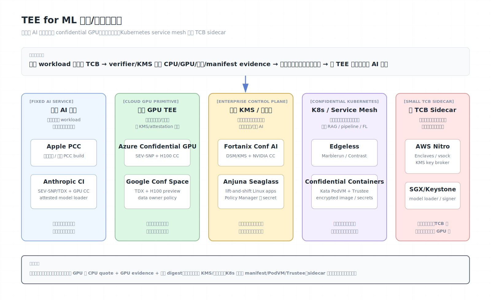

# TEE for ML / Confidential AI

TEE for ML，也常被称为 Confidential AI 或 confidential inference，是把硬件可信执行环境用于机器学习训练、推理和模型托管的一类架构模式。它的目标不是发明一种新的 TEE，而是把 CPU TEE、GPU TEE、远程证明、密钥释放、模型服务运行时和输出治理组合起来，让敏感数据、模型权重和执行代码只在可证明的受保护边界内以明文出现。

本文主要参考 AI Wiki 的 [Trusted Execution Environments for machine learning](https://aiwiki.ai/wiki/tee_for_ml)（页面标注 2026-06-07 更新）并结合 NVIDIA、Apple、Google Confidential Space、AWS Nitro Enclaves、Fortanix、Edgeless、Anjuna 和 Confidential Containers 等官方资料整理。AI Wiki 页面本身标注为 Needs citations，因此这里将其作为综述线索，而不是唯一事实来源。

## 架构图





## 为什么 ML 需要 TEE

传统云上 ML 服务有两个方向相反但同样棘手的秘密：

- 用户或企业侧秘密：prompt、RAG 文档、训练数据、微调数据、embedding、工具调用参数和输出结果。
- 模型提供方秘密：模型权重、system prompt、解码策略、模型路由逻辑、LoRA/adapter、商业特征工程和防滥用策略。

普通云部署中，宿主机内核、VMM、云管理员、调试工具、日志系统、GPU 管理路径或同机租户都有机会成为明文路径的一部分。密码学方案如 FHE/MPC 能减少硬件信任，但在大模型推理和训练上通常仍有显著性能与工程成本。TEE for ML 的定位是折中：在保留接近原生硬件性能的同时，把信任边界收缩到硬件、固件、被证明的 guest/workload、GPU 安全固件和密钥策略。

典型目标包括：

- 用户相信模型服务商和云平台看不到请求明文。
- 模型方相信客户或云平台管理员拿不到权重明文。
- 数据合作方只把数据交给经过证明的训练或分析代码。
- 审计方能知道某次推理、训练或评测是否运行在预期软硬件组合上。

## 核心 Primitive

TEE for ML 依赖三类底层 primitive，但在 ML 场景里它们的组合方式比普通密钥服务更复杂。

| Primitive | 在 TEE 中的含义 | ML 场景里的关键点 |
| --- | --- | --- |
| 受保护内存 | CPU/GPU 内存由硬件密钥加密或受访问控制保护，host 不能直接读写明文 | 不只保护用户输入，还要覆盖模型权重、KV cache、中间激活、梯度、optimizer state、checkpoint |
| 远程证明 | 硬件对启动状态、固件、镜像、配置和 nonce 生成可验证 evidence | Verifier/KMS 必须同时检查 CPU quote、GPU evidence、镜像 digest、TCB 版本、debug 状态和策略 |
| 安全 I/O | 数据离开 CPU 私有内存后仍通过加密链路、受保护 DMA、vsock、TEE-I/O 或应用层加密保护 | CPU 到 GPU、GPU 到 GPU、磁盘、网络、对象存储、日志、metrics 都可能重新打开明文路径 |

这三个 primitive 必须形成闭环。只保护 CPU 内存但 GPU 路径明文，或只证明 GPU 但 guest 镜像不可控，都不能构成端到端机密 AI。

## 威胁模型

TEE for ML 通常希望排除在明文边界之外的对象：

- 云平台 operator、宿主机 root、VMM、host kernel。
- 同机其他租户、普通管理代理和调试工具。
- 父 VM 或部署项目管理员，取决于 Nitro Enclaves、Confidential Space 等平台模型。
- GPU 设备路径上的未授权观察者、普通 PCIe/DMA 路径和不受信任驱动面。
- 模型客户侧基础设施管理员，适用于模型方保护权重的场景。

通常仍然信任：

- CPU/SoC/GPU 硬件根、微码、固件、TEE 管理组件。
- 厂商 attestation PKI、证书撤销和 TCB 状态发布。
- Guest OS、驱动、CUDA/ROCm/runtime、模型服务进程和容器镜像。
- Verifier、KMS、CI/CD 签名策略和供应链元数据。

通常不自动解决：

- Workload 自己的漏洞，例如反序列化、路径穿越、越权 API、prompt injection、日志泄露。
- 合法输出造成的统计泄露，例如训练数据抽取、membership inference、模型反演、模型提取。
- DoS、资源降速、粗粒度元数据、流量大小和时序侧信道。
- 供应链配置错误，例如镜像 tag 可变、debug 版本进生产、KMS policy 过宽。

## CPU TEE 在 ML 中的角色

CPU TEE 负责承载模型服务的控制面和密钥边界。不同粒度适合不同形态：

| 技术类型 | 代表 | 适合的 ML 用法 | 主要限制 |
| --- | --- | --- | --- |
| 应用级 enclave | Intel SGX、Keystone | 小型模型服务、密钥 unwrap、模型加载器、敏感后处理 | 内存容量和系统调用边界复杂；对大模型训练/推理不友好 |
| VM 级 TEE | Intel TDX、AMD SEV-SNP、Arm CCA、IBM Secure Execution | lift-and-shift 模型服务、容器运行时、GPU 驱动、Kubernetes PodVM | Guest TCB 较大；I/O、共享页、设备路径需要额外保护 |
| 受限子 VM/enclave | AWS Nitro Enclaves | KMS 代理、签名服务、模型密钥服务、敏感 sidecar | 无网络/无持久磁盘；通常不直接承载 GPU 大模型 |
| 托管 confidential workload | Google Confidential Space、Azure CVM、Apple PCC | 多方数据协作、固定 AI 推理服务、云厂商 KMS/IAM 集成 | 平台绑定更强；策略、透明日志和云控制面成为关键 |

对于大模型，主流趋势是 VM 级 TEE + GPU TEE。SGX 这类应用级 enclave 仍适合做“小 TCB 密钥闸门”，但很难独自承载完整 LLM 推理栈。

## GPU TEE 与加速器边界

ML 的特殊性在于明文最终会进入加速器。没有 GPU 侧保护时，CPU TEE 只能保护模型到达 GPU 之前的路径，GPU HBM、command buffer、kernel、DMA 和管理面仍可能暴露。

NVIDIA Hopper H100/H200 把 confidential computing 扩展到 GPU 侧，核心思路包括 GPU 安全启动、固件度量、CC mode、GPU attestation、受保护 HBM，以及 CPU confidential VM 到 GPU 之间的受保护数据路径。Blackwell 一代进一步强调 TEE-I/O 和多 GPU/NVLink/NVSwitch 场景下的链路保护。具体支持能力取决于 GPU 型号、云实例、VBIOS、驱动、CUDA、CC mode 和平台组合。

GPU TEE 在策略上至少要回答：

- GPU 是否是真实受支持设备，而不是被模拟或降级的设备。
- GPU 是否处于 CC mode，debug、profiling、性能计数器等能力是否按策略关闭或限制。
- GPU firmware/VBIOS/GSP/安全处理器版本是否在允许列表。
- CPU confidential VM 与 GPU evidence 是否属于同一个会话和同一台 workload。
- CPU-GPU、GPU-GPU、GPU-存储或 GPU-NIC 路径是否仍会出现未加密明文。

## 典型 Confidential Inference 流程

一个端到端 confidential inference 系统通常由四个角色组成：

| 角色 | 职责 |
| --- | --- |
| 用户/数据拥有方 | 加密 prompt、RAG 数据或任务输入；验证服务证明；接收输出 |
| 模型拥有方 | 加密发布模型权重；定义允许的 runtime 和版本策略 |
| Confidential runtime | 在 CVM/TEE 内启动模型服务、解密权重、处理请求、约束输出路径 |
| Verifier/KMS | 验证 CPU/GPU/workload evidence，按策略释放数据密钥或模型密钥 |

典型流程：

```text
1. 构建镜像：
   固化 guest image、container digest、模型加载器、驱动/runtime 版本和 release 策略。

2. 启动环境：
   云平台启动 TDX/SEV-SNP/CCA 等 confidential VM，并把 GPU 置于支持的 CC 模式。

3. 收集证明：
   guest 内 attestation agent 获取 CPU quote/report、vTPM PCR、workload digest、
   GPU attestation evidence，并绑定 verifier nonce 或临时会话公钥。

4. 验证策略：
   verifier 检查厂商证书链、TCB 版本、撤销状态、measurement、镜像 digest、
   GPU 固件、debug 状态、实例/区域/项目属性和 nonce 新鲜性。

5. 释放密钥：
   KMS 或模型拥有方只向合格 workload 释放模型权重密钥、数据密钥或 API 会话密钥。

6. 执行推理：
   模型权重、prompt、RAG 数据和 KV cache 只在 CPU/GPU 受保护边界内以明文出现。

7. 返回输出：
   输出经应用层加密、访问控制、审计、速率限制和必要的隐私策略后返回调用方。
```

这个流程的关键不是“有一个 TEE”，而是证明、密钥和数据流必须绑定到同一个被允许的软硬件组合。

## 主流产品/方案全景

AI Wiki 原文的 comparative summary 把当前 TEE for ML 生态分成云厂商产品、AI 服务架构、企业 KMS/编排平台和开源 confidential Kubernetes 几类。下面这张表覆盖原文 summary 中的 8 项：Apple PCC、Anthropic Confidential Inference、Azure Confidential GPU、Google Confidential Space + CC GPU、AWS Nitro Enclaves、Fortanix Confidential AI、Edgeless Marblerun/Contrast、Confidential Containers；并补入同一段落中提到但没有进入 summary 表的 Anjuna Seaglass。状态/成熟度以 AI Wiki 页面 2026-06-07 的整理为准，落地前仍应复核厂商最新文档。

| 系统/方案 | TEE 技术 | 工作负载 | 原文状态/成熟度 | 架构形态 | 主要保护对象 | 关键注意点 |
| --- | --- | --- | --- | --- | --- | --- |
| Apple Private Cloud Compute | Apple-silicon Secure Enclave、Apple 自定义云节点 | Apple Intelligence 云侧推理 | iOS 18 起生产使用 | 固定厂商 AI 服务，客户端只向可证明 PCC build 发送请求 | 用户请求、上下文、云侧推理中间状态 | 不面向任意第三方 workload；依赖 Apple 透明日志、设备策略和固定软件栈 |
| Anthropic Confidential Inference | AMD SEV-SNP / Intel TDX + NVIDIA H100/H200 CC | 选定 Claude 推理 | 2025-06 发布架构论文 | 模型服务参考架构，API server + attested model loader + confidential inference VM | 用户 prompt、输出、模型权重、release key | 重点是推理与权重保护；依赖 CI/release 策略、GPU 证明和云实例支持 |
| Azure Confidential GPU / CVM | AMD SEV-SNP + NVIDIA H100 CC，部分场景结合 TDX/CVM 能力 | 客户自管 AI workload | 原文标注 GA | 云平台 confidential GPU 产品 | 企业数据、模型权重、GPU HBM 中间状态 | 需要严格核对实例规格、驱动、CUDA、GPU CC mode、Azure attestation/KMS 策略 |
| Google Confidential Space + CC GPU | Intel TDX + NVIDIA H100 CC，Confidential Space attestation claims | 客户自管 AI workload、多方数据协作 | 原文标注 TDX+H100 preview | 受证明容器 workload + 数据拥有方 policy + cloud KMS/attestation | 多方数据、模型评估、训练/分析输入 | 重点是 data owner policy；preview 能力、claim 精度、输出路径和镜像 digest 是核心风险 |
| AWS Nitro Enclaves | Nitro Hypervisor 隔离 microVM | 通用机密 workload、KMS 代理、签名/解密服务 | 2020 起 GA | 父 EC2 中的受限子 VM，无网络/无持久磁盘，通过 vsock 通信 | 密钥、token、证书、模型密钥代理 | 不是完整 GPU 推理栈；适合作为 AI 系统里的小 TCB sidecar 或 key broker |
| Fortanix Confidential AI | NVIDIA CC GPU + Fortanix Confidential Computing Manager + Fortanix DSM/KMS | 企业模型 IP 保护、企业 AI factories 推理 | 原文标注 GA | 商业 KMS/attestation/control plane，面向混合云和本地 AI 工厂 | 第三方模型权重、客户敏感输入、推理密钥 | 平台策略和 Fortanix 控制面进入信任链；适合“模型方和企业互不完全信任”的部署 |
| Edgeless Marblerun / Contrast | Marblerun: Intel SGX；Contrast: Intel TDX / AMD SEV-SNP CVM | confidential service mesh、Kubernetes confidential apps、AI pipeline | 开源/商业支持 | Manifest 驱动的全部署证明、Coordinator/CA、mTLS service mesh、secret provisioning | 微服务间数据、pipeline secret、模型/数据处理服务 | Marblerun 偏 SGX enclave mesh，Contrast 偏 CVM/Kata/Kubernetes；应用漏洞和输出仍需治理 |
| Confidential Containers (CoCo) | Kata Containers PodVM + TDX / SEV-SNP / IBM Secure Execution 等 | Confidential Kubernetes、RAG、推理、微调、联邦学习 | CNCF sandbox | 每个 Pod 运行在 TEE microVM 内，guest 内拉取/解密镜像，AA/CDH/Trustee 完成证明和密钥释放 | Pod 内数据、镜像层、secret、RAG 文档库、FL client/aggregator | Pod-centric TCB；需配置 Trustee policy、encrypted image、composite attestation 和 GPU evidence |
| Anjuna Seaglass | Intel SGX/TDX、AMD SEV-SNP、AWS Nitro Enclaves 等 | 无代码改造的 Linux 应用、SaaS/ISV 安全 AI | 商业平台 | 把现有应用封装成 Anjuna Confidential Containers，Policy Manager 根据证明放 secret | 现有应用内存、TLS key、数据库/AI 服务 secret、客户数据 | 优势是 lift-and-shift；代价是平台抽象和策略管理成为信任边界的一部分 |

这些系统的共同模式是“先证明，后放密钥”。差异主要在四个维度：

- 谁控制 workload：Apple/Anthropic 这类固定服务由服务商控制；Azure/Google/CoCo/Contrast 让客户控制镜像；Fortanix/Anjuna 提供企业控制面；Nitro Enclaves 常作为父实例里的小隔离组件。
- 证明粒度是什么：PCC build、confidential VM measurement、container digest、Kubernetes manifest、SGX MRENCLAVE、GPU firmware/VBIOS evidence、vTPM PCR 都可能成为策略输入。
- 明文在哪里出现：固定 AI 服务只在厂商 TEE 内；云 GPU 服务在客户 CVM/GPU 内；CoCo/Contrast 在 PodVM/CVM 内；Nitro 常只在小型 key service 内。
- 输出如何管：TEE 只能约束运行时明文访问，不能自动阻止模型通过合法输出泄露训练样本、prompt、RAG 文档或模型能力。

## 逐项方案分析

### Apple Private Cloud Compute

Apple PCC 是“产品化固定 AI 服务”路线。用户设备在本地判断请求能否本地处理；需要云侧能力时，请求被发送到 Apple 自建的 PCC 节点。PCC 的安全重点不是让用户部署任意模型，而是让 Apple Intelligence 的云侧推理具备可验证的隐私边界。

架构关键点：

- 固定 workload：PCC 节点运行 Apple 发布的受限软件栈，而不是客户自定义容器。
- 可验证透明度：Apple 发布生产 PCC build，客户端和研究者可以验证实际运行软件与公开版本的关系。
- 无特权运行时访问：运维人员不能通过传统 debug、shell、日志或管理通道读取请求明文。
- 非定向化：系统避免把特定用户请求定向到特定可被攻击或特殊配置的节点。

适合场景是个人设备 AI 请求的云侧扩展；不适合企业自带模型、自带容器或多云部署。它的边界强在“固定软件 + 设备生态 + 透明发布”，弱在不可迁移、不可自定义，并且仍然不解决模型输出层面的统计泄露。

### Anthropic Confidential Inference

Anthropic 的方案更像“前沿模型服务的参考架构”。它把用户 API 入口、数据解密、模型权重解密和 GPU 推理拆开，让 model loader 作为高价值小 TCB，只在 CPU/GPU evidence 满足策略后解密模型权重。

架构关键点：

- 推理 VM 运行在 SEV-SNP 或 TDX 这类 confidential VM 中，并使用 H100/H200 GPU CC mode。
- Model loader 接收 KMS/release pipeline 放出的权重密钥，验证后加载模型。
- API server 负责用户侧协议、鉴权、请求解密和响应加密，降低 model loader 暴露面。
- Release 过程绑定 CI、代码审查和签名策略，用来防止未经批准的软件版本拿到权重。
- 设计同时关注用户 prompt 隐私和模型权重防盗，对应高安全等级模型部署的现实需求。

这类架构的核心不是“把所有东西塞进一个 TEE”，而是把权重解密点、用户数据解密点、GPU evidence 和 release policy 绑定起来。主要风险是 release pipeline、API server、模型服务代码和输出通道仍然很关键；如果这些组件被允许输出任意数据，TEE 也会按策略“安全地执行错误行为”。

### Azure Confidential GPU / CVM

Azure 的路线是“云平台 primitive 产品化”：把 confidential VM、guest attestation、Key Vault/Managed HSM、NVIDIA H100 CC 等能力组合成客户可部署的云实例。与 PCC 或 Anthropic 不同，Azure 更偏 IaaS/PaaS 基础能力，客户可以迁移自己的模型服务栈。

架构关键点：

- CPU 侧依赖 SEV-SNP/TDX 等 confidential VM 隔离 host 和 VMM。
- GPU 侧依赖 H100/H200 的 CC mode、GPU attestation 和受保护 HBM。
- 密钥释放可绑定 Azure attestation token、vTPM/PCR、镜像 digest、实例属性和客户策略。
- 与 Azure Key Vault、Managed Identity、AKS/容器生态结合后，可以形成企业推理平台。

适合已有 Azure 治理体系的企业，把模型服务迁移到 confidential GPU 上。关键坑点是支持矩阵：实例型号、区域、镜像、guest kernel、NVIDIA 驱动、CUDA、GPU firmware、CC mode、attestation 工具都要匹配。只验证 VM 而不验证 GPU，或只验证实例类型而不验证 workload digest，都不足以保护端到端 AI 数据流。

### Google Confidential Space + CC GPU

Google Confidential Space 的核心是“数据拥有方策略驱动的受证明容器”。它特别适合多方数据协作：operator 可以部署 workload，但数据拥有方只根据 attestation claims 释放数据或密钥。加入 TDX + H100 CC 后，这个模型可以扩展到 GPU AI workload。

架构关键点：

- Workload 是容器镜像，运行在 Confidential Space 环境和 confidential VM 之上。
- Attestation token 表达硬件 TEE、镜像 digest、启动参数、service account、project 等 claims。
- 数据拥有方按 policy 判断是否释放 dataset key、RAG 文档 key、模型评估数据或训练数据。
- 对 GPU workload，还需要把 GPU evidence 与 CPU/容器 evidence 绑定，避免“合格容器 + 不合格加速器路径”。

适合 clean room、联合分析、模型评估、机密训练和多方数据集上的 AI 处理。风险集中在 policy 精度和输出控制：如果 policy 只绑定项目或镜像 tag，而不是 immutable digest 和启动参数，operator 可能替换 workload；如果输出 sink 太宽，可信 workload 仍可能把原始数据写出去。

### AWS Nitro Enclaves

Nitro Enclaves 不是完整的 GPU confidential inference 平台，而是“父实例内的小型隔离 microVM”。它没有持久磁盘和普通网络，通常通过 vsock 与父实例通信。对 AI 系统而言，它常见的角色是密钥代理、签名服务、token broker 或敏感后处理组件。

架构关键点：

- Enclave image file 产生 PCR，KMS policy 可绑定 attestation document。
- 父实例负责网络、磁盘和请求转发，但理论上不应拿到 enclave 内明文密钥。
- Enclave 适合解包模型密钥、签名审计记录、处理证书或做小规模敏感逻辑。
- 父实例仍可 DoS、重放请求、观察流量元数据，因此应用协议必须有 nonce、session binding 和重放保护。

在 TEE for ML 中，Nitro Enclaves 更适合做“密钥闸门”而不是直接跑大模型。比如父实例或 GPU 服务请求解密权重时，enclave 先验证外部证明或业务策略，再通过 vsock 返回短期会话密钥。它的优点是小 TCB 和 AWS KMS 集成成熟；短板是不能单独保护 GPU HBM 或完整模型服务栈。

### Fortanix Confidential AI

Fortanix 走的是“企业级控制面 + NVIDIA confidential GPU”的商业平台路线。它把 Confidential Computing Manager、Data Security Manager/KMS、policy enforcement 和 NVIDIA CC GPU 组合起来，解决模型方和企业方互不完全信任的问题。

架构关键点：

- 模型方发布加密权重，企业在本地、混合云或 AI factory 中运行推理。
- Fortanix 控制面验证 runtime、GPU/TEE 状态和 workload policy 后释放模型密钥。
- 企业数据留在企业环境中，模型方不应看到客户 prompt 和输出。
- 模型方也不需要把权重明文交给企业管理员，降低模型复制和二次分发风险。

这个方案适合“第三方高价值模型进入企业私有环境”的商业场景：模型方需要 IP 保护，企业需要数据主权。安全边界除了 CPU/GPU TEE，还包括 Fortanix KMS、策略审批、密钥生命周期和审计系统。风险在于平台控制面本身进入关键路径，策略配置错误会直接变成密钥释放错误。

### Edgeless Marblerun / Contrast

Edgeless 是原文里漏掉后影响很大的一类：它不是单个 AI 模型服务，而是 confidential workload 的 service mesh / Kubernetes 平台。Marblerun 早期面向 SGX enclave 集群，Contrast 则把思路扩展到 TDX/SEV-SNP CVM 和 Kubernetes。

Marblerun 架构关键点：

- 把多个 SGX enclave 服务组织成 “Marbles”，每个 Marble 可以用 EGo、Gramine 或 Occlum 构建。
- 用 manifest 描述全部署的预期状态，包括每个服务的身份、measurement、secret、恢复策略和连接关系。
- Coordinator 对每个 Marble 做远程证明，证明通过后分发 secret，并为服务间通信配置 mTLS。
- 对外提供一个“整个部署符合 manifest”的 succinct attestation，而不是要求用户逐个验证 enclave。

Contrast 架构关键点：

- 通过 Kubernetes RuntimeClass 和 Kata Containers，把 Pod 运行在 confidential VM 中。
- Coordinator 自身也运行在 CVM 中，作为 attestation authority 和 service mesh CA。
- Manifest 包含受信任 workload 的哈希与配置，CVM attestation 必须匹配 manifest 后才能加入 mesh。
- 通过自动 mTLS 保护 pod-to-pod 和外部客户端到服务的通信。

Edgeless 这类方案适合 AI pipeline、RAG 服务、微服务化模型服务、多方数据处理和 SaaS 证明场景。它的价值是把“单个 TEE 证明”提升为“整套服务拓扑证明”。风险也相应上移：manifest 是否准确、Coordinator 是否可用、镜像供应链是否可复现、Kubernetes 动态配置是否全部纳入策略，都会决定实际安全性。TEE 不会审计业务 API，因此模型输出、prompt injection 和数据外传仍要靠应用层控制。

### Confidential Containers (CoCo)

CoCo 是 CNCF sandbox 的 confidential Kubernetes 路线，采用 pod-centric 设计：不是把单个容器单独放进 enclave，也不是把整个 worker node 放进 TEE，而是让每个 Pod 运行在 Kata microVM/PodVM 中。Pod 内容器可以共享网络命名空间和本地通信，但 host、kubelet、其他 pod 和控制面不在信任边界内。

架构关键点：

- Host 上 kubelet/containerd/kata-shim 仍负责编排，但不应看到 Pod 内明文。
- Guest 内 Kata Agent 启动容器，image-rs 在 guest 内拉取镜像，ocicrypt-rs 解密加密镜像层。
- Attestation Agent 生成硬件/guest evidence，Confidential Data Hub 处理 secret 请求。
- Trustee/KBS/AS/RVPS 作为外部 verifier 和 key broker，校验证明后释放 secret。
- 对 AI 场景，CoCo 文档强调 GPU composite attestation，把 vCPU 和 accelerator evidence 绑定后再放 secret。

CoCo 很适合把 RAG、推理、微调和联邦学习部署进 Kubernetes：RAG 文档库、vector DB、aggregator、FL client 都可以作为 confidential pod。它的关键优势是云原生工作流和开源生态；关键挑战是 TCB 包含 guest 组件、策略系统、镜像解密链路和 Trustee。部署者必须理解哪些 Kubernetes API 会跨越 confidential boundary，不能把普通 `kubectl exec`、动态 env、宽松 egress 当成安全默认值。

### Anjuna Seaglass

Anjuna Seaglass 是商业 lift-and-shift 平台，目标是把现有 Linux 应用或容器在不改代码的情况下迁移到 confidential runtime。它在 AI 场景中的价值是让 SaaS、ISV 或企业已有模型服务更容易进入 TEE，而不是要求团队直接面对 SGX/TDX/SEV-SNP/Nitro 的底层接口。

架构关键点：

- Build 阶段把原应用转成 Anjuna Confidential Containers 或 enclave-ready hardened image。
- Deploy 阶段跨 AWS、Azure、Google Cloud 或本地环境发布，减少厂商特定 glue code。
- Run 阶段提供 in-use、at-rest、in-transit 的持续加密保护。
- Trust 阶段由 Anjuna Policy Manager 做 attestation-aware secrets store，根据证明和授权策略释放 secret。

适合想保护现有模型 API、数据库代理、向量服务、SaaS 后端或 AI 数据处理服务的企业。优势是迁移门槛低；短板是平台抽象层、Policy Manager、运行时镜像和供应链成为关键 TCB。对高安全等级模型权重保护，仍应明确 GPU evidence、权重 release policy、日志和输出约束，而不能只依赖“应用已在 confidential container 中运行”。

## 架构形态总结

| 形态 | 代表方案 | 最适合 | 主要强项 | 主要短板 |
| --- | --- | --- | --- | --- |
| 固定 AI 产品 | Apple PCC、Anthropic Confidential Inference | 面向最终用户的受控 AI 服务 | 服务商能把软件栈、release、证明、审计做成闭环 | 不一定开放给任意 workload；客户自定义能力有限 |
| 云上 confidential GPU primitive | Azure Confidential GPU、Google Confidential Space + CC GPU | 企业自管模型服务、多方数据协作 | 易接入云 KMS/IAM/镜像/网络生态 | 支持矩阵复杂，CPU/GPU/镜像/策略必须同时正确 |
| 企业 KMS/控制面 | Fortanix Confidential AI、Anjuna Seaglass | 第三方模型进入企业环境、旧应用迁移 | 策略、密钥、证明、审计产品化 | 平台控制面进入信任链，厂商绑定更强 |
| Confidential Kubernetes / service mesh | Edgeless Marblerun/Contrast、Confidential Containers | RAG、AI pipeline、微服务、FL、SaaS | 把多组件部署变成可证明拓扑，贴近云原生 | 策略复杂，Kubernetes 动态面和输出通道容易漏控 |
| 小 TCB sidecar/enclave | AWS Nitro Enclaves、SGX/Keystone loader | 密钥代理、签名、权重 unwrap、小型敏感逻辑 | TCB 小，适合把密钥边界做窄 | 不直接解决 GPU HBM 和完整模型服务保护 |

## 应用场景

### 机密推理

用户把 prompt 和上下文发送给运行在 TEE 中的模型服务。服务端 operator 不能直接读取请求、输出或中间状态。适合企业知识库问答、医疗/金融助手、法律文档分析、个人数据代理和需要防云侧明文访问的 API。

关键设计点：

- 客户端或网关应验证 attestation 后再建立会话密钥。
- RAG 文档、embedding、工具调用参数和输出都要纳入数据分类。
- 只保护 runtime 不够，还要避免日志、trace、metrics、错误栈和缓存落明文。

### 模型 IP 保护

模型方把权重以密文形式交给客户云或第三方平台。只有当硬件、guest、GPU、模型加载器和 release policy 都通过证明时，KMS 才释放权重密钥。这样可以降低客户管理员、云管理员或恶意运维直接复制权重的风险。

关键设计点：

- 权重解密和加载逻辑应尽量小，最好独立于复杂业务 API。
- 权重密钥应绑定 measurement、GPU evidence、版本和用途。
- checkpoint、LoRA、adapter、tokenizer、system prompt 也可能是 IP。

### 机密训练与联合训练

多个数据方把加密数据提供给约定训练 workload。TEE 证明训练代码、镜像和环境后释放数据密钥，训练过程在 confidential VM/GPU 内执行，最终只输出模型、梯度、指标或聚合结果。

关键设计点：

- 训练 recipe、数据访问范围、输出对象和 checkpoint 策略必须提前固定。
- 训练结果可能记忆原始样本，TEE 需要和差分隐私、评估审计、输出阈值结合。
- 多方数据协作还要考虑参与方之间的授权、撤回、审计和法律约束。

### 计算来源与治理

TEE attestation 能为“某个模型输出来自哪个镜像、哪个硬件 TCB、哪个模型版本和哪个 release policy”提供证据。它不能证明模型结论正确，但能把运行环境纳入审计链。

适合：

- AI agent 调用敏感工具前校验 runtime。
- 监管或客户审计模型服务版本。
- 模型评测平台证明评测脚本未被 operator 篡改。
- 数据 clean room 证明只运行约定查询。

## 安全边界与限制

TEE for ML 的边界应按数据生命周期逐段检查：

| 阶段 | 应保护内容 | 常见风险 |
| --- | --- | --- |
| 构建 | 镜像、模型加载器、驱动版本、签名、SBOM | 构建机被污染、tag 漂移、debug 镜像进入生产 |
| 启动 | TCB 版本、firmware、PCR/measurement、GPU CC mode | 测量不完整、策略只验 CPU 不验 GPU、nonce 未绑定 |
| 密钥释放 | 模型密钥、数据密钥、会话密钥 | KMS policy 过宽、证书撤销未查、密钥复用 |
| 数据加载 | prompt、RAG、训练数据、权重、tokenizer | 明文临时文件、对象存储缓存、日志泄露 |
| 推理/训练 | KV cache、activation、gradient、optimizer state | GPU 路径不受保护、多租户资源侧信道、runtime 漏洞 |
| 输出 | 文本、embedding、模型、指标、checkpoint | 成员推断、训练数据抽取、模型提取、授权输出变成外传通道 |

重要限制：

- TEE 不会自动阻止模型通过正常 API 泄露训练数据或商业秘密。
- TEE 不修复不安全的模型服务代码，也不能抵消 prompt injection 对工具调用的影响。
- 侧信道仍然存在，尤其是共享缓存、内存访问模式、页错误、GPU 资源争用和时序。
- 厂商 PKI、固件更新、TCB 状态和撤销机制成为供应链信任的一部分。
- Host 仍能拒绝服务、降低性能、观察粗粒度元数据或影响调度。
- 多 GPU、RDMA、NVLink/NVSwitch、GPUDirect Storage 会扩大 I/O 证明边界。

## 与 FHE、MPC、联邦学习、差分隐私的关系

| 技术 | 保护方式 | 优势 | 在 ML 中的短板 | 与 TEE 的组合 |
| --- | --- | --- | --- | --- |
| TEE for ML | 明文只在受证明硬件边界内出现 | 性能接近原生，能复用现有模型栈 | 信任硬件和厂商 PKI，侧信道和输出泄露仍需治理 | 作为实际推理/训练运行时 |
| FHE | 在密文上计算 | 不需要信任硬件运行方 | 大模型训练/推理成本高，算子和模型结构受限 | 用于小型敏感子计算或结果验证 |
| MPC | 多方秘密分享联合计算 | 不信任单一硬件或云 | 通信和交互成本高，恶意安全实现复杂 | TEE 可作为加速器或参与方隔离层 |
| 联邦学习 | 数据留在本地，上传模型更新 | 原始数据不集中 | 梯度泄露、投毒、恶意聚合方 | TEE 保护聚合器、训练 coordinator 或客户端证明 |
| 差分隐私 | 限制单样本对输出分布的影响 | 直接处理统计输出泄露 | 需要隐私预算和精度权衡 | TEE 保护原始训练过程，DP 控制最终模型/统计输出 |

生产系统常常是组合式的：TEE 保护运行时明文，DP 控制输出泄露，MPC/FHE 用在跨组织或强不信任场景，联邦学习减少数据集中化。

## 工程检查清单

- 明确敌手：云 operator、模型客户、模型服务商、数据合作方、同租户还是外部攻击者。
- 列出所有明文点：CPU 内存、GPU HBM、共享页、临时文件、日志、trace、metrics、checkpoint、输出 sink。
- 证明绑定完整：CPU quote、GPU evidence、vTPM PCR、container digest、模型加载器 hash、驱动/runtime 版本和 nonce。
- 密钥分层：模型权重密钥、用户数据密钥、会话密钥、日志/审计密钥分开管理。
- 策略精确：使用 immutable digest 和 allowlist，避免只按镜像 tag、实例类型或项目名放行。
- 默认 fail closed：证明失败、TCB 过期、证书撤销、GPU 非 CC mode、debug 开启时拒绝释放密钥。
- 输出治理：限制输出路径、做审计、设置速率限制，对统计结果考虑 DP 或阈值。
- 供应链闭环：CI 签名、SBOM、reproducible build、透明日志或 release manifest。
- 运维最小化：禁用 core dump、明文日志、调试 shell、profiling、非必要网络出口。
- 回滚治理：明确 measurement 版本生命周期，防止旧漏洞镜像重新获得密钥。

## 选型建议

- 只需要保护模型服务中的密钥或小段逻辑：优先评估 SGX、Nitro Enclaves 或小 TCB sidecar。
- 需要迁移完整推理服务：优先评估 TDX、SEV-SNP、Arm CCA 或云上 Confidential VM。
- 需要保护 GPU 中的模型权重和用户输入：必须评估 GPU CC、CPU-GPU 路径和 GPU evidence，而不是只看 CPU TEE。
- 多方数据协作或 clean room：优先看 Confidential Space、Confidential Containers、MPC/TEE 混合方案。
- 最担心模型输出泄露训练数据：TEE 只是底座，还要加入差分隐私、访问控制和输出审计。

## 参考资料

- AI Wiki: Trusted Execution Environments for machine learning: https://aiwiki.ai/wiki/tee_for_ml
- Confidential Computing Consortium: A Technical Analysis of Confidential Computing: https://confidentialcomputing.io/
- NVIDIA: Confidential Computing on H100 GPUs for Secure and Trustworthy AI: https://developer.nvidia.com/blog/confidential-computing-on-h100-gpus-for-secure-and-trustworthy-ai/
- NVIDIA Trusted Computing Solutions: https://docs.nvidia.com/nvtrust/index.html
- Apple Security Research: Private Cloud Compute: https://security.apple.com/blog/private-cloud-compute/
- Microsoft Azure Confidential Computing: https://learn.microsoft.com/en-us/azure/confidential-computing/overview
- AWS Nitro Enclaves: https://docs.aws.amazon.com/enclaves/latest/user/nitro-enclave.html
- Fortanix Confidential AI: https://www.fortanix.com/platform/confidential-ai
- Edgeless Marblerun: https://www.edgeless.systems/products/marblerun
- Edgeless Contrast: https://docs.edgeless.systems/contrast/
- Anjuna Seaglass Platform: https://www.anjuna.io/product
- Google Cloud: Confidential Space overview: https://docs.cloud.google.com/confidential-computing/confidential-space/docs/confidential-space-overview
- Confidential Containers: Overview and architecture: https://confidentialcontainers.org/docs/overview/
- Confidential Containers: Confidential AI use case: https://confidentialcontainers.org/docs/use-cases/confidential-ai/
